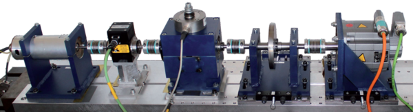

# Datasets

- [CWRU](#cwru)
- [HUST](#hust)
- [HUSTbearing](#hustbearing)
- [SCA](#sca)
- [MPFT](#mpft)
- [Paderborn](#paderborn)
- [FEMTO (A.K.A. Pronostia)](#femto-aka-pronostia)
- [IMS](#ims)
- [XJTU-SY](#xjtu-sy)
- [JNU](#jnu)
- [MAFAULDA](#mafaulda)
- [Politecnico di Torino - DIRG](#politecnico-di-torino---dirg)
- [SEU](#seu)
- [Ottawa](#ottawa)
- [SDOL](#sdol)
- [KAIST](#kaist)
- [UNSW](#unsw)
- [HIT-SM](#hit-sm)
- [HIT](#hit)
- [SUSU](#susu)

## CWRU

Website https://engineering.case.edu/bearingdatacenter

## HUST

Paper https://bmcresnotes.biomedcentral.com/articles/10.1186/s13104-023-06400-4

## HUSTbearing

Paper https://www.sciencedirect.com/science/article/pii/S0951832024000395?via%3Dihub

## SCA

Paper https://www.mdpi.com/2306-5729/8/7/115

| ID  | Bearing         | Sampling Rate (Hz) | Placement    | Placement Side | Fixed Speed | Average Rotation Speed (RPM) | Fault Type          |
| --- | --------------- | ------------------ | ------------ | -------------- | ----------- | ---------------------------- | ------------------- |
| 1   | SKF 22320 E     | 640                | Wire roller  | DS             | No          | 1120.6                        | Inner ring          |
| 2   | SKF 6310        | 5120               | Engine       | DS             | Yes         | 1162.0                        | Outer ring          |
| 3   | SKF 6310        | 512                | Wire roller  | FS             | No          | 34.6                          | Inner ring          |
| 4   | SKF NU328 E     | 8192               | Pump         | FS             | No          | 1100.3                        | Inner ring          |
| 5   | SKF 7312 BEAP   | 12,800             | Pump         | DS             | No          | 2483.5                        | Ball                |
| 6   | SKF NU328 E     | 6400               | Pump         | FS             | No          | 1208.2                        | Inner ring          |
| 7   | SKF 7221 BECBY  | 4096               | Strainer     | Upper          | Yes         | 700                           | Inner ring          |
| 8   | SKF 6228        | 5120               | Engine       | DS             | No          | 1105.9                        | Outer ring          |
| 9   | SKF 6310        | 5120               | Engine       | DS             | Yes         | 1162.0                        | Outer ring          |
| 10  | SKF NU316 ECP   | 5120               | Engine       | DS             | No          | 189.3                         | Outer ring          |
| 11  | SKF 6228        | 5120, 12,800       | Engine       | FS             | No          | 189.3                         | Not bearing related |

## MPFT

Data download - https://www.mfpt.org/fault-data-sets/

## Paderborn

Apparently, the original link is not available anymore (https://mb.uni-paderborn.de/kat/forschung/datacenter/bearing-datacenter), alternative link - https://data.mendeley.com/datasets/65d3pzth7v/1

## FEMTO (A.K.A. Pronostia)

Data download - https://github.com/Lucky-Loek/ieee-phm-2012-data-challenge-dataset?tab=readme-ov-file

## IMS

First paper: https://www.sciencedirect.com/science/article/pii/S0022460X0500221X#aep-section-id43

Most used citation: J. Lee, H. Qiu, G. Yu, J. Lin, and Rexnord Technical Services (2007). IMS, University of Cincinnati. “Bearing Data Set”, NASA Prognostics Data Repository, NASA Ames Research Center, Moffett Field, CA

Data download - https://www.nasa.gov/intelligent-systems-division/discovery-and-systems-health/pcoe/pcoe-data-set-repository/

## XJTU-SY

Data download - https://biaowang.tech/xjtu-sy-bearing-datasets/

## JNU

Paper - https://www.sciencedirect.com/science/article/pii/S0952197623001549#b12
Data download - https://github.com/ClarkGableWang/JNU-Bearing-Dataset

## MAFAULDA

Data download - https://www02.smt.ufrj.br/~offshore/mfs/page_01.html#SEC1

Paper using this dataset - https://www.researchgate.net/publication/318767684_Improved_Similarity-Based_Modeling_for_the_Classification_of_Rotating-Machine_Failures

## Politecnico di Torino - DIRG

Paper https://www.sciencedirect.com/science/article/pii/S0888327018306800?via%3Dihub#s0095

## SEU

Paper https://ieeexplore.ieee.org/abstract/document/8432110/

Data download - https://mlmechanics.ics.uci.edu/

## Ottawa

Paper https://www.sciencedirect.com/science/article/pii/S2352340918314124

Data download - https://data.mendeley.com/datasets/v43hmbwxpm/1

## SDOL

Paper https://www.mdpi.com/2076-3417/10/20/7302

Data download - https://www.kau-sdol.com/bearing

## KAIST

Paper https://www.sciencedirect.com/science/article/pii/S2352340923001671

## UNSW

Paper - https://www.sciencedirect.com/science/article/pii/S0888327021008116#s0030
Data download - https://data.mendeley.com/datasets/h4df4mgrfb/3

## HIT-SM

Paper - https://iopscience.iop.org/article/10.1088/1361-6501/ac7941/meta
Data download - https://github.com/hitwzc/Bearing-datasets

### SpectraQuest MFS dataset

### Seelf-built test rig dataset

## HIT

Paper - https://ojs.istp-press.com/dmd/article/view/314/333
Data download - https://github.com/HouLeiHIT/HIT-dataset

## SUSU

Paper - https://www.sciencedirect.com/science/article/pii/S0888327022005714?via%3Dihub#s0005

Data download - https://github.com/susu-cm/bearings-dataset

# Inspiration

https://github.com/hustcxl/Rotating-machine-fault-data-set/tree/master

