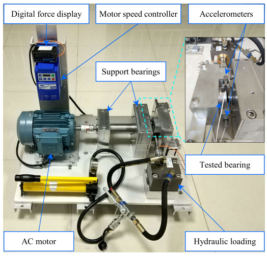
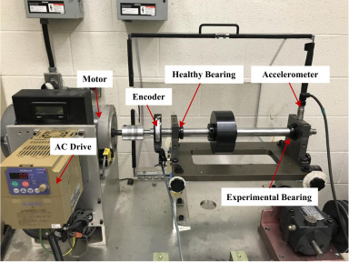

# Awesome Bearing Datasets for Diagnostics and Prognostics

A curated collection of public datasets for bearing fault diagnosis and prognostics, intended for researchers and engineers in condition monitoring and predictive maintenance.

---

## Summary of Datasets

The following table provides a consolidated overview of prominent datasets for rapid comparison.

| Dataset                                                          | Originating Institution(s)                          | Year      | Primary Task | Fault Generation       | Key Signals                  |
| :--------------------------------------------------------------- | :-------------------------------------------------- | :-------- | :----------- | :--------------------- | :--------------------------- |
| [Case Western Reserve University (CWRU)](#case-western-reserve-university-cwru) | Case Western Reserve University                     | ~1999     | Diagnosis    | Artificial (EDM)       | Vibration (DE, FE)           |
| [HUST (Hanoi University of Science and Technology)](#hust-hanoi-university-of-science-and-technology) | Hanoi University of Science and Technology          | 2023      | Diagnosis    | Artificial (Cracks)    | Vibration                    |
| [HUST (Huazhong University of Science and Technology)](#hust-huazhong-university-of-science-and-technology) | Huazhong University of Science and Technology       | ~2023     | Diagnosis    | Artificial             | Vibration                    |
| [SCA Bearing Dataset](#sca-bearing-dataset)                      | Mittuniversitetet                                   | 2024      | Diagnosis    | Natural (Industrial)   | Vibration                    |
| [Machinery Failure Prevention Technology (MFPT)](#machinery-failure-prevention-technology-mfpt) | Machinery Failure Prevention Technology               | ~2000s    | Diagnosis    | Artificial & Natural   | Vibration                    |
| [Paderborn University (PU)](#paderborn-university-pu)            | Paderborn University                                | 2016      | Diagnosis    | Artificial & Natural   | Vibration, Motor Current     |
| [FEMTO-ST (PRONOSTIA)](#femto-st-pronostia)                        | FEMTO-ST Institute                                  | 2012      | Prognostics  | Natural (Accelerated)  | Vibration, Temperature       |
| [NASA IMS](#nasa-ims)                                            | IMS, University of Cincinnati / NASA                | ~2004     | Prognostics  | Natural (Accelerated)  | Vibration                    |
| [Xi'an Jiaotong University (XJTU-SY)](#xian-jiaotong-university-xjtu-sy) | Xi'an Jiaotong University & Sumyoung Tech.            | 2019      | Prognostics  | Natural (Accelerated)  | Vibration                    |
| [Jiangnan University (JNU)](#jiangnan-university-jnu)            | Jiangnan University                                 | ~2023     | Diagnosis    | Artificial (Dents)     | Vibration                    |
| [MAFAULDA (Machinery Fault Database)](#mafaulda-machinery-fault-database) | UFRJ                                                | ~2018     | Diagnosis    | Artificial             | Vibration, Acoustic          |
| [Politecnico di Torino](#politecnico-di-torino)                  | Politecnico di Torino                               | 2024      | Diagnosis    | Artificial             | Vibration, Temperature, Speed|
| [German Aerospace Center (DLR)](#german-aerospace-center-dlr)    | German Aerospace Center                             | 2023      | Diagnosis    | Artificial (Spalls)    | Vibration                    |
| [Southeast University (SEU)](#southeast-university-seu)          | Southeast University                                | ~2016     | Diagnosis    | Artificial             | Vibration, Torque            |
| [University of Ottawa](#university-of-ottawa)                    | University of Ottawa                                | 2018/2023 | Diagnosis    | Artificial & Natural   | Vibration, Acoustic, Speed   |
| [University of Seoul (UOS) / SDOL](#university-of-seoul-uos--sdol) | University of Seoul / Konkuk University             | 2022      | Diagnosis  | Artificial (Accelerated)  | Vibration, Temperature       |
| [KAIST Bearing Datasets](#kaist-bearing-datasets)                | KAIST                                               | ~2023     | Prognostics/ Diagnosis    | Natural (Accelerated)             | Current, Vibration, Torque   |
| [University of New South Wales (UNSW)](#university-of-new-south-wales-unsw) | University of New South Wales                       | 2022      | Prognostics  | Natural (Accelerated)  | Vibration                    |
| [Harbin Institute of Technology (HIT-SM)](#harbin-institute-of-technology-hit-sm) | Harbin Institute of Technology                        | ~2022     | Diagnosis    | Artificial             | Vibration                    |
| [PHM09 Gearbox](#phm09-gearbox)                                  | PHM Society                                         | 2009      | Diagnosis    | Artificial             | Vibration                    |
| [University of Ferrara](#university-of-ferrara)                  | University of Ferrara                               | 2024      | Prognostics  | Natural (Accelerated)  | Vibration                    |
| [SUBF v2.0 Dataset: Bearing Faults Sound Data](subf-v20-dataset-bearing-faults-sound-data) | University of Engineering and Technology Taxila      | 2025      | Diagnosis    | Artificial             | Acoustic                     |
| [FSTF Mechanical Laboratory](#fstf-mechanical-laboratory)       | FSTF Mechanical Laboratory at Sidi Mohamed Ben Abdellah University  | 2023      | Diagnosis    | Artificial & Natural | Acoustic |

---

## Datasets Description

### Case Western Reserve University (CWRU)

| **Overview:** The CWRU dataset is the most frequently cited benchmark in bearing fault diagnosis. It provides vibration data from a motor test rig with artificially induced faults, serving as a de facto standard for validating new classification algorithms.  **Experimental Setup:** The test stand used a 2 hp motor with SKF deep-groove ball bearings. Single-point faults of varying diameters (0.007 to 0.040 inches) were introduced using electro-discharge machining (EDM).  **Data Characteristics:** The dataset contains vibration data from drive-end (DE) and fan-end (FE) accelerometers, sampled at 12 kHz and 48 kHz in MATLAB `.mat` format.  **Operating Conditions:** Experiments were run under four motor loads (0, 1, 2, and 3 hp), corresponding to speeds from approximately 1797 to 1730 RPM.  **Source:** [CWRU Bearing Data Center](https://engineering.case.edu/bearingdatacenter) |  |
| :--- | :--- |

---

### Xi'an Jiaotong University (XJTU-SY)

| **Overview:** The XJTU-SY dataset is a high-quality resource for fault prognostics, containing complete run-to-failure data from 15 rolling element bearings under accelerated degradation.  **Experimental Setup:** Bearings were run under stressful conditions until natural failure, capturing the entire degradation trajectory.  **Data Characteristics:** Contains horizontal and vertical vibration signals sampled at 25.6 kHz, recorded in 1.28-second snapshots at one-minute intervals.  **Operating Conditions:** Experiments were conducted under three different working conditions, varying in rotational speed and radial load (e.g., 2100 RPM/12 kN, 2250 RPM/11 kN).  **Source:** [GitHub Repository](https://github.com/WangBiaoXJTU/xjtu-sy-bearing-datasets) |  |
| :--- | :--- |

---

### Paderborn University (PU)

| **Overview:** The PU dataset is a comprehensive resource for fault diagnosis, notable for its inclusion of multiple data modalities and a combination of artificial and natural faults.  **Experimental Setup:** A modular test rig was used to collect data from 32 bearings: 6 healthy, 12 with artificial damage, and 14 with real damage from accelerated life tests.  **Data Characteristics:** Provides high-resolution vibration and motor current signals, both sampled at 64 kHz, in `.mat` format.  **Operating Conditions:** Data was collected under four conditions, with different combinations of rotational speed (1500/900 RPM), load torque, and radial force.  **Source:** [Paderborn University Bearing Datacenter](https://mb.uni-paderborn.de/en/kat/research/kat-datacenter/bearing-datacenter) |  |
| :--- | :--- |

---

### NASA IMS

| **Overview:** A seminal run-to-failure dataset from the NASA Ames Prognostics Data Repository, widely used for validating RUL prediction algorithms.  **Experimental Setup:** Four bearings were run continuously until failure under a significant radial load. The dataset contains three separate run-to-failure experiments.  **Data Characteristics:** Vibration data was collected at 20 kHz in 1-second snapshots every 10 minutes, provided in ASCII text files.  **Operating Conditions:** All experiments were conducted under a single, constant condition: 2000 RPM speed and 6000 lbs radial load.  **Source:** [NASA Prognostics Data Repository](https://data.nasa.gov/dataset/ims-bearings) |  |
| :--- | :--- |

---

### FEMTO-ST (PRONOSTIA)

| **Overview:** The centerpiece of the 2012 IEEE Prognostic Challenge, consisting of 17 accelerated run-to-failure experiments designed to validate prognostic methods.  **Experimental Setup:** A testbed applied heavy loads to accelerate bearing degradation. Tests were halted when vibration exceeded a 20g safety threshold.  **Data Characteristics:** Includes horizontal/vertical vibration (25.6 kHz) and temperature signals, captured in intermittent 0.1-second bursts every 10 seconds.  **Operating Conditions:** Includes three distinct operating conditions, each with a different combination of speed and load.  **Source:** Unofficial Mirror: [GitHub](https://github.com/Lucky-Loek/ieee-phm-2012-data-challenge-dataset) |  |
| :--- | :--- |

---

### HUST (Hanoi University of Science and Technology)

| **Overview:** A modern resource for fault diagnosis created to address the limitation of single-bearing-type datasets.  **Experimental Setup:** Data was collected from a purpose-built testbench. Artificially induced faults include cracks and combination faults (e.g., inner race + ball).  **Data Characteristics:** Contains 99 raw vibration signals, each sampled at 51.2 kHz for 10 seconds.  **Operating Conditions:** Experiments cover five different bearing types under three different motor loads, making it ideal for testing generalization.  **Source:** [Mendeley Data](https://data.mendeley.com/datasets/cbv7jyx4p9/1) |  |
| :--- | :--- |

---

### HUST (Huazhong University of Science and Technology)

| **Overview:** This dataset focuses on fault diagnosis under variable speed conditions and with multiple fault severities.  **Experimental Setup:** Data was collected from a SpectraQuest Machinery Fault Simulator with artificially induced faults of multiple severity levels.  **Data Characteristics:** Consists of vibration signals, each sampled at 25.6 kHz for 10 seconds.  **Operating Conditions:** Experiments were conducted under 11 distinct RPM conditions to test robustness against non-stationary operations.  **Source:** [GitHub Repository](https://github.com/CHAOZHAO-1/HUSTbearing-dataset) |  |
| :--- | :--- |

---

### SCA Bearing Dataset
* **Overview:** A unique resource containing vibration measurements of naturally occurring faults from an operational pulp mill, bridging the gap between laboratory and industrial environments.
* **Experimental Setup:** Data was collected from various machines between 2019 and 2022. The 11 cases include documented bearing failures and one confirmed non-bearing fault (shaft misalignment).
* **Data Characteristics:** Raw vibration data in `.mat` format, with "train" files (healthy data) and "test" files (data leading to failure). Includes signals, timestamps, speed, and fault labels.
* **Operating Conditions:** As the data is from a live industrial setting, operating conditions such as speed and load vary significantly.
* **Source:** [Mendeley Data](https://data.mendeley.com/datasets/tdn96mkkpt/2)

---

### Machinery Failure Prevention Technology (MFPT)
* **Overview:** One of the earliest public datasets, offering a hybrid of data from a laboratory test rig and real-world machinery.
* **Experimental Setup:** Includes baseline and artificial fault data from a test rig, alongside valuable real-world fault data from components like wind turbine bearings.
* **Data Characteristics:** Primarily vibration signals in `.mat` format, with high sampling rates for the test rig data.
* **Operating Conditions:** The test rig data was collected at a constant speed (25 Hz) with a range of different loads. Real-world conditions vary by application.
* **Source:** [MFPT Society](https://www.mfpt.org/fault-data-sets/)

---

### Jiangnan University (JNU)

| **Overview:** A modern resource featuring artificially induced faults, designed to provide clean data for developing classification algorithms under different speed domains.  **Experimental Setup:** Data was collected from a test rig using a single accelerometer. Faults were simulated by creating tiny dents on bearing components via wire-cutting.  **Data Characteristics:** Contains vibration signals sampled at 50 kHz, provided in `.csv` format.  **Operating Conditions:** Experiments were conducted under three distinct rotational speeds: 600, 800, and 1000 RPM.  **Source:** [GitHub Repository](https://github.com/ClarkGableWang/JNU-Bearing-Dataset) |  |
| :--- | :--- |

---

### MAFAULDA (Machinery Fault Database)

| **Overview:** A comprehensive resource that extends beyond bearing faults to include other common issues like imbalance and misalignment, facilitating system-level diagnostics.  **Experimental Setup:** Data was generated on a SpectraQuest Machinery Fault Simulator, covering normal operation and various fault types.  **Data Characteristics:** The dataset is multi-modal, with each recording containing 8 channels: a tachometer signal, 3-axis acceleration for two bearings, and a microphone for acoustic signals.  **Operating Conditions:** Covers a range of operating conditions specific to individual experimental files.  **Source:** [UFRJ Website](https://www02.smt.ufrj.br/~offshore/mfs/page_01.html) |  |
| :--- | :--- |

---

### Politecnico di Torino

| **Overview:** Addresses a specific gap in public data by focusing on medium-to-large-sized spherical roller bearings common in heavy industrial applications.  **Experimental Setup:** Data was collected from a large-scale test rig using SKF spherical roller bearings with various localized, artificially induced defects.  **Data Characteristics:** The dataset is multi-modal, containing vibration, temperature, and speed measurements.  **Operating Conditions:** Experiments were conducted across a range of different operating conditions.  **Source:** [Polito Institutional Research Information System](https://iris.polito.it/handle/11583/2993655) |  |
| :--- | :--- |

---

### German Aerospace Center (DLR)

| **Overview:** A specialized dataset designed to support research into fault size estimation and prognosis, with a focus on aerospace-relevant bearings and operating conditions.  **Experimental Setup:** Data was collected using FAG axial ball bearings. Faults were seeded as fatigue spalls of various sizes to emulate realistic damage.  **Data Characteristics:** Contains 28 time-series vibration measurements, each sampled at 25.6 kHz.  **Operating Conditions:** Experiments were conducted under various combinations of rotational speed and high axial load to match aerospace conditions.  **Source:** [Mendeley Data](https://data.mendeley.com/datasets/y6d87f2b9g/1) |  |
| :--- | :--- |

---

### Southeast University (SEU)

| **Overview:** A comprehensive resource collected from a Drivetrain Dynamics Simulator (DDS), including data for both bearings and gears to allow for the study of complex mechanical systems.  **Experimental Setup:** The data was acquired from the DDS test rig and is divided into sub-datasets for bearing and gear faults.  **Data Characteristics:** Contains multivariate time-series data with 8 channels, including vibration from multiple components and motor torque. Vibration was sampled at 12 kHz.  **Operating Conditions:** Data was collected under two speed-load configurations: 20 Hz-0V and 30 Hz-2V.  **Source:** [GitHub Repository](https://github.com/cathysiyu/Mechanical-datasets) |  |
| :--- | :--- |

---

### University of Ottawa

| **Overview:** A collection of complementary datasets addressing key research frontiers such as non-stationary conditions and fault severity assessment.  **Experimental Setup & Conditions:** The 2018 dataset focuses on diagnosing faults under four time-varying speed profiles. The 2023 dataset focuses on three distinct health stages (healthy, developing, faulty) under constant conditions.  **Data Characteristics:** The 2018 dataset contains vibration (200 kHz) and encoder data. The 2023 dataset contains accelerometer, acoustic, motor speed, and load data (42 kHz).  **Source:** [2018 Data](https://data.mendeley.com/datasets/v43hmbwxpm/1) \| [2023 Data](https://data.mendeley.com/datasets/y2px5tg92h/1) | **2018**   **2023**  |
| :--- | :--- |

---

### University of Seoul (UOS) / SDOL

| **Overview:** A comprehensive and challenging resource designed to mirror the complexities of real-world industrial applications, with a crucial focus on variable operating conditions.  **Experimental Setup:** The testbed can emulate a wide variety of faults (bearing, coil, misalignment) with multiple severity levels.  **Data Characteristics:** Exceptionally rich in sensor modalities, including multi-resolution data from three-phase current, vibration, torque, and RPM sensors.  **Operating Conditions:** A key distinguishing feature is the use of randomized speed fluctuations and variable load conditions.  **Source:** [Paper](https://doi.org/10.1016/j.dib.2024.110940) \| [Mendeley Data](https://data.mendeley.com/datasets/53vtnjy6c6) \| [SDOL Dataset](https://www.kau-sdol.com/bearing) | 
| :--- | :--- |

---

### KAIST Bearing Datasets

| **Overview:** A run-to-failure dataset that captures the entire lifespan of a ball bearing under accelerated testing, making it suitable for multi-modal prognostics research.  **Experimental Setup:** An accelerated life test was run for 128 hours until failure criteria (temperature or vibration threshold) were met.  **Data Characteristics:** Includes vibration data (x- and y-axes) and temperature data, sampled at 25.6 kHz. The published dataset consists of hourly snapshots.  **Operating Conditions:** The experiment was run at a nearly constant speed of 1770-1780 RPM under significant load.  **Source:** [Paper Run-to-Failure](https://www.sciencedirect.com/science/article/pii/S235234092400372X) \| [Paper Diagnosis](https://www.sciencedirect.com/science/article/pii/S2352340923001671) | **Run-to-Failure**   **Diagnosis**  |
| :--- | :--- |

---

### University of New South Wales (UNSW)

| **Overview:** A run-to-failure resource with a specific focus on developing methods for bearing fault severity assessment by tracking the natural evolution of spalls.  **Experimental Setup:** Contains data from four separate run-to-failure experiments where spall damage developed naturally under operational stress.  **Data Characteristics:** Contains horizontal and vertical acceleration signals and an encoder signal, provided in `.mat` format.  **Operating Conditions:** Data was collected at multiple speeds throughout the run-to-failure tests.  **Source:** [Mendeley Data](https://data.mendeley.com/datasets/h4df4mgrfb/3) |  |
| :--- | :--- |

---

### Harbin Institute of Technology (HIT-SM)

| **Overview:** A dataset explicitly designed for research into cross-domain fault diagnosis and transfer learning.  **Experimental Setup:** Composed of two sub-datasets from two physically different test rigs (SpectraQuest MFS and a self-built rig) with identical fault types and bearing models.  **Data Characteristics:** Contains vertical vibration signals collected at a sampling frequency of 51.2 kHz for both rigs.  **Operating Conditions:** For both test rigs, data was collected at three identical driving speeds: 600, 900, and 1200 RPM.  **Source:** [GitHub Repository](https://github.com/hitwzc/Bearing-datasets) |  |
| :--- | :--- |

---

### PHM09 Gearbox
* **Overview:** The basis for the 2009 PHM Society Data Challenge, this dataset focuses on a multi-stage gearbox, representing a more complex system where bearing faults are one of several possibilities.
* **Experimental Setup:** Data was collected from a generic industrial gearbox test rig with multiple shafts, gears, and bearings, including various gear and bearing fault conditions.
* **Data Characteristics:** Data was collected synchronously from accelerometers and a tachometer, with a sampling frequency of 66.67 kHz.
* **Operating Conditions:** Data was collected at five different shaft speeds under both high and low load conditions.
* **Source:** [PHM Society Public Data Sets](https://phmsociety.org/public-data-sets/)

---

### University of Ferrara

| **Overview:** A run-to-failure dataset specifically focused on the prognostics of self-aligning double-row ball bearings.  **Experimental Setup:** The dataset was created from six accelerated run-to-failure tests under a constant radial load.  **Data Characteristics:** Contains continuous radial acceleration signals recorded for the entire duration of each test.  **Operating Conditions:** Experiments were conducted under constant speed and load to provide a controlled environment for observing degradation.  **Source:** [University of Ferrara Research Data](https://sfera.unife.it/handle/11392/2569668) |  |
| :--- | :--- |

---

### SUBF v2.0 Dataset: Bearing Faults Sound Data
| **Overview:**  This dataset is an audio-based benchmark for rolling bearings fault diagnosis. It contains machine sound recordings from an induction-motor test rig under three bearing health conditons (healthy, inner race fault, outer race fault).  **Experimental Setup:** The dataset was created on an in-house test rig at the University of Engineering and Technology Taxila, which consisted of a 3-phase 0.25 HP, 50 Hz induction motor running at 1440 RPM, driving a shaft supported by two bearings. The bearing on the left side of the shaft was swapped between healthy, inner race fault, and outer race fault units. A low-cost omnidirectional condenser microphone (BOYA BY-M1) was positioned close to the test bearing, connected to a laptop used for data recording.  **Data Characteristics:** Contains a total of 18 hours of machine sounds recorded at a sampling frequency of 10 kHz, with 6 hours for each health class (healthy, IR, OR). Each continuous 1-hour run was segmented into non-overlapping 10 second clips, creating 2160 signals per health condition (6480 clips in total).  **Operating Conditions:** All recordings were taken at nominally constant speed (1440 RPM) under steady supply conditions, with no deliberate variation in load or speed. Faults correspond to localized inner-race and outer-race defects seeded in one bearing, while the other bearing remains healthy, ensuring that class differences are dominated by the target bearing condition.  **Source:** [Kaggle – SUBF v2.0 Dataset: Bearing Faults Sound Data](https://www.kaggle.com/datasets/sumairaziz/subf-v2-0-dataset-bearing-faults-sound-data/data) |  |
| :--- | :--- |

---

### FSTF Mechanical Laboratory

| **Overview:** The FSTF Mechanical Laboratory dataset provides sound recordings of ball bearings under both normal and faulty conditions at different operating speeds. It is built on a rotor test rig and is intended to support research on acoustic-based bearing fault diagnosis. Sound is captured at positions proximal and distal to the bearing housings, offering a benchmark for audio-based machine diagnostics.  **Experimental Setup:** Experiments were conducted on a specialized rotor system (PT 500 with the PT 500.12 roller bearing faults kit from Gunt) equipped with SKF 6004 deep-groove ball bearings. Fault conditions include artificially induced localized defects on the inner race, outer race, and rolling element (ball), as well as a looseness defect resulting from prolonged operation (natural). Recordings were made at multiple operating speeds and at different sensor positions relative to the bearing housings.  **Data Characteristics:** The dataset is divided into two main categories: **Dataset 1**, consisting of recordings obtained using a stethoscope, and **Dataset 2**, consisting of recordings without a stethoscope under different operating conditions. In both cases, sound signals are acquired as `.wav` files using the **VibroTeak** mobile application (developed by the authors) at a sampling rate of **44.1 kHz**. The audio files are then imported into MATLAB (via `audioread`) for further processing.  **Operating Conditions:** Tests cover normal and faulty bearings over a range of rotational speeds and measurement configurations (proximal/distal to the housing, with/without stethoscope). This variability, combined with real acoustic background noise, makes the dataset well suited for developing and benchmarking robust diagnostic algorithms for rolling-element bearings using sound data.  **Source:** [Mendeley Data – Sound Datasets of a Rolling Element Bearing under Various Conditions](https://data.mendeley.com/datasets/n9y9c7xrz3/1) |  |
| :--- | :--- |

## 🤝 How to Contribute

This document is intended to be a living resource. Contributions are welcome to ensure it remains accurate, comprehensive, and up-to-date.

* **Open an Issue:** For any proposed changes or additions, please open a new issue in the repository's issue tracker.
* **Provide Details:** In the issue, clearly describe the proposed change. If suggesting a new dataset, please provide a link to its official source, a reference to a primary publication, and a summary of its key characteristics.
* **Submit a Pull Request (Optional):** For those comfortable with Markdown and Git, you can fork the repository, make your changes directly, and submit a pull request for review.

## Inspiration

This list was inspired by the work of repositories like [hustcxl/Rotating-machine-fault-data-set](https://github.com/hustcxl/Rotating-machine-fault-data-set/tree/master).

## License

This project is licensed under the [MIT License](LICENSE).
