# Dataset Descriptions

Detailed descriptions of the datasets listed in the [README](../README.md#summary-of-datasets).

## Core Datasets

### Case Western Reserve University (CWRU)

| **Overview:** Vibration data from a motor test rig with artificially induced bearing faults, released by the Case Western Reserve University Bearing Data Center. Its reference study has the highest citation count in this list (see [citations](citations.md)).  **Experimental Setup:** The test stand used a 2 hp motor with SKF deep-groove ball bearings. Single-point faults of varying diameters (0.007 to 0.040 inches) were introduced using electro-discharge machining (EDM).  **Data Characteristics:** The dataset contains vibration data from drive-end (DE) and fan-end (FE) accelerometers, sampled at 12 kHz and 48 kHz in MATLAB `.mat` format.  **Operating Conditions:** Experiments were run under four motor loads (0, 1, 2, and 3 hp), corresponding to speeds from approximately 1797 to 1730 RPM.  **Source:** [CWRU Bearing Data Center](https://engineering.case.edu/bearingdatacenter) \| [Commonly Cited Benchmark Study (MSSP, 2015)](https://doi.org/10.1016/j.ymssp.2015.04.021) | 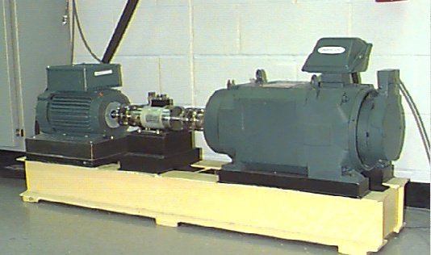 |
| :--- | :--- |

---

### Xi'an Jiaotong University (XJTU-SY)

| **Overview:** A prognostics dataset containing complete run-to-failure data from 15 rolling element bearings under accelerated degradation.  **Experimental Setup:** Bearings were run under stressful conditions until natural failure, capturing the entire degradation trajectory.  **Data Characteristics:** Contains horizontal and vertical vibration signals sampled at 25.6 kHz, recorded in 1.28-second snapshots at one-minute intervals.  **Operating Conditions:** Experiments were conducted under three different working conditions, varying in rotational speed and radial load (e.g., 2100 RPM/12 kN, 2250 RPM/11 kN).  **Source:** [GitHub Repository](https://github.com/WangBiaoXJTU/xjtu-sy-bearing-datasets) \| [Publication (IEEE Trans. Reliability, 2020)](https://doi.org/10.1109/TR.2018.2882682) | 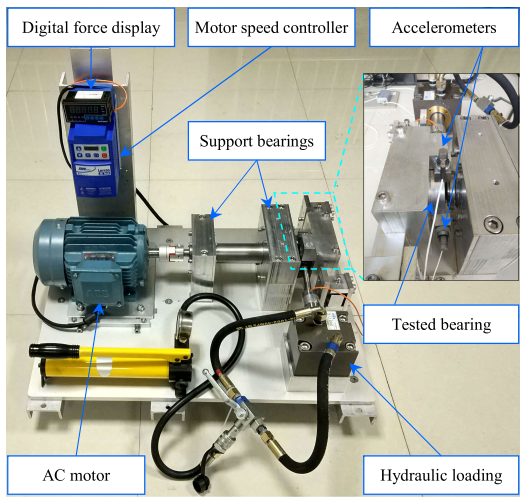 |
| :--- | :--- |

---

### Southeast University (SEU)

| **Overview:** Data collected from a Drivetrain Dynamics Simulator (DDS), with separate sub-datasets for bearing faults and gear faults.  **Experimental Setup:** The data was acquired from the DDS test rig and is divided into sub-datasets for bearing and gear faults.  **Data Characteristics:** Contains multivariate time-series data with 8 channels, including vibration from multiple components and motor torque. The sampling rate is not stated in the repository.  **Operating Conditions:** Data was collected under two speed-load configurations: 20 Hz-0V and 30 Hz-2V.  **Source:** [GitHub Repository](https://github.com/cathysiyu/Mechanical-datasets) \| [Publication (IEEE Trans. Industrial Informatics, 2019)](https://doi.org/10.1109/TII.2018.2864759) | 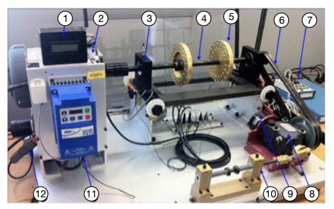 |
| :--- | :--- |

---

### HUST (Huazhong University of Science and Technology)

| **Overview:** This dataset focuses on fault diagnosis across many rotational speeds and with two fault severities.  **Experimental Setup:** Data was collected from a SpectraQuest Machinery Fault Simulator with artificially induced faults of multiple severity levels.  **Data Characteristics:** Consists of vibration signals, each sampled at 25.6 kHz for 10 seconds.  **Operating Conditions:** 11 operating conditions: ten constant speeds (20–80 Hz) and one time-varying 0–40–0 Hz profile. The README header mentions four operating conditions but lists 11.  **Source:** [GitHub Repository](https://github.com/CHAOZHAO-1/HUSTbearing-dataset) \| [Publication (Reliability Engineering & System Safety, 2024)](https://doi.org/10.1016/j.ress.2024.109964) | 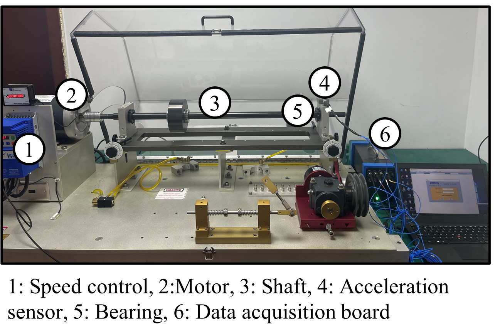 |
| :--- | :--- |

---

### Paderborn University (PU)

| **Overview:** A fault diagnosis dataset with vibration and motor current signals, covering both artificial damage and natural damage from accelerated life tests.  **Experimental Setup:** A modular test rig was used to collect data from 32 bearings: 6 healthy, 12 with artificial damage, and 14 with real damage from accelerated life tests.  **Data Characteristics:** Provides vibration and motor current signals, both sampled at 64 kHz, in `.mat` format.  **Operating Conditions:** Data was collected under four conditions, with different combinations of rotational speed (1500/900 RPM), load torque, and radial force.  **Source:** [Paderborn University Bearing Datacenter](https://mb.uni-paderborn.de/en/kat/research/bearing-datacenter) \| [Publication (PHM Society European Conference, 2016)](https://doi.org/10.36001/phme.2016.v3i1.1577) | 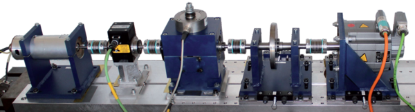 |
| :--- | :--- |

---

### Paderborn University (Time-Varying Run-to-Failure)

* **Overview:** A run-to-failure dataset of ball bearings subjected to time-varying load and speed conditions. It comes from the same institution as the PU diagnosis dataset and targets prognostics under non-stationary operating conditions.
* **Experimental Setup:** Ball bearings were run to failure under dynamically changing load and speed profiles rather than constant conditions.
* **Data Characteristics:** Contains vibration and temperature signals recorded throughout the bearing's entire lifecycle.
* **Operating Conditions:** Time-varying speed and load profiles.
* **Source:** [Zenodo (DOI: 10.5281/zenodo.10805042)](https://doi.org/10.5281/zenodo.10805042) | [Publication (PHM Society European Conference 2024)](https://papers.phmsociety.org/index.php/phme/article/view/4101)

---

### NASA IMS

| **Overview:** A run-to-failure dataset distributed through the NASA Ames Prognostics Data Repository and used in remaining useful life (RUL) prediction studies.  **Experimental Setup:** Four bearings were run continuously until failure under a constant radial load. The dataset contains three separate run-to-failure experiments.  **Data Characteristics:** Vibration data was collected at 20 kHz in 1-second snapshots every 10 minutes, provided in ASCII text files.  **Operating Conditions:** All experiments were conducted under a single, constant condition: 2000 RPM speed and 6000 lbs radial load.  **Source:** [NASA Prognostics Data Repository](https://data.nasa.gov/dataset/ims-bearings) \| [Publication (Journal of Sound and Vibration, 2006)](https://doi.org/10.1016/j.jsv.2005.03.007) | 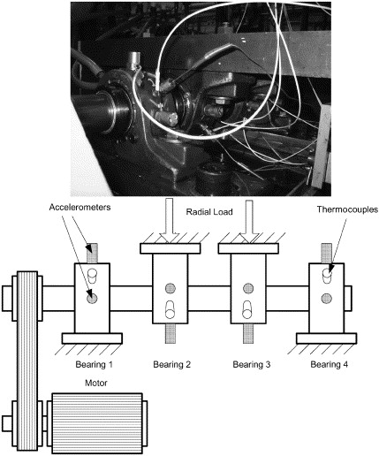 |
| :--- | :--- |

---

### University of Ottawa Time-Varying Speed (2018)

| **Overview:** A diagnosis dataset recorded under time-varying rotational speed. The record's title is *Bearing Vibration Data under Time-varying Rotational Speed Conditions*; it has no official acronym.  **Experimental Setup:** A SpectraQuest machinery fault simulator (MFS-PK5M) with two ER16K ball bearings; the right-hand bearing is replaced to set the health condition. Version 2 contains 60 recordings covering healthy, inner race, outer race, ball, and combined faults (version 1 had only 36 recordings: healthy, inner race, and outer race). How the defects were made is not stated.  **Data Characteristics:** Vibration (accelerometer) and shaft speed (encoder), sampled at 200 kHz for 10 s per recording.  **Operating Conditions:** Four speed profiles: increasing, decreasing, increasing then decreasing, and decreasing then increasing.  **Source:** [Mendeley Data (v2)](https://data.mendeley.com/datasets/v43hmbwxpm/2) \| [Publication (Data in Brief, 2018)](https://doi.org/10.1016/j.dib.2018.11.019) | 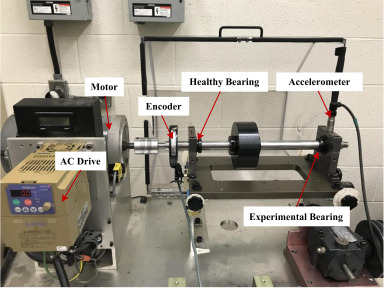 |
| :--- | :--- |

---

### UORED-VAFCLS (University of Ottawa, 2023)

| **Overview:** The *University of Ottawa Rolling-element Dataset – Vibration and Acoustic Faults under Constant Load and Speed conditions* (UORED-VAFCLS) follows bearings through three health stages (healthy, developing fault, faulty), supporting fault severity assessment.  **Experimental Setup:** Faults are introduced in the drive-end bearing of a motor. 20 bearings cover inner race, outer race, ball, and cage faults, each recorded at the developing and faulty stages, plus healthy recordings. Faults developed naturally in accelerated runs of bearings with seals removed and grease washed out. Tests 1–5 (inner race) used NSK 6203ZZ bearings and tests 6–20 used FAFNIR 203KD bearings.  **Data Characteristics:** Accelerometer, microphone, load cell, Hall-effect speed sensor, and two thermocouples, sampled at 42 kHz for 10 s per recording. Spectrogram images are also provided.  **Operating Conditions:** Constant speed (1750 RPM) and constant load.  **Caveat:** Ball-fault data was recorded at no load, while all other conditions were recorded at 400 N. Load is therefore confounded with the ball-fault class. Bearing manufacturer is likewise confounded with the inner-race class.  **Source:** [Mendeley Data](https://data.mendeley.com/datasets/y2px5tg92h/1) \| [Publication (Data in Brief, 2023)](https://doi.org/10.1016/j.dib.2023.109327) | 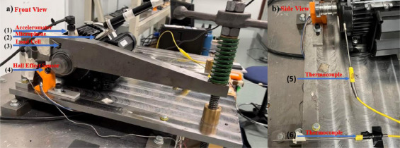 |
| :--- | :--- |

---

### KAIST Run-to-Failure

| **Overview:** A run-to-failure dataset that captures the entire lifespan of a ball bearing under accelerated testing.  **Experimental Setup:** An accelerated life test was run for 128 hours until failure criteria (bearing temperature above 85 °C and vibration above 9 m/s²) were met.  **Data Characteristics:** Includes vibration data (x- and y-axes) and temperature data, sampled at 25.6 kHz. The published dataset consists of hourly snapshots.  **Operating Conditions:** The experiment was run at a nearly constant speed of 1770-1780 RPM under an axial load of 2.94 kN and a vertical load of 5.88 kN. Note that versions 1–3 of the Mendeley record state 3600 RPM; versions 4–6 state 1770–1780 RPM. The description here follows version 6.  **Source:** [Mendeley Data (v6)](https://data.mendeley.com/datasets/5hcdd3tdvb/6) \| [Publication (Data in Brief, 2024)](https://doi.org/10.1016/j.dib.2024.110403) | 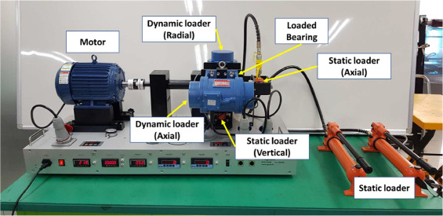 |
| :--- | :--- |

---

### KAIST Varying Load (Multi-Sensor)

| **Overview:** A multi-sensor diagnosis dataset of a rotating machine under three load levels, designed for sensor-fusion research (e.g., vibration–acoustic or vibration–current).  **Experimental Setup:** Conditions include normal, bearing inner race and outer race faults (0.3, 1.0, and 3.0 mm), shaft misalignment (three levels), and rotor unbalance (five masses, 583–3318 mg, per the paper's Table 2).  **Data Characteristics:** Vibration (two housings, x and y), temperature, and three-phase motor current sampled at 25.6 kHz; acoustic data sampled at 51.2 kHz. Recordings last 120 s in the normal state and 60 s in faulty states.  **Operating Conditions:** Load torques of 0, 2, and 4 Nm.  **Caveat:** Acoustic data was acquired for bearing faults only under no load, to avoid noise from the air-cooled brake.  **Source:** [Mendeley Data (v5)](https://data.mendeley.com/datasets/ztmf3m7h5x/5) \| [Publication (Data in Brief, 2023)](https://doi.org/10.1016/j.dib.2023.109049) | 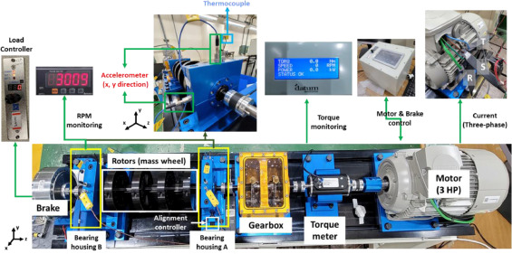 |
| :--- | :--- |

---

### KAIST Varying Speed

* **Overview:** A bearing diagnosis dataset recorded while the motor speed varies randomly, described in the same Data in Brief article as the KAIST varying-load dataset.
* **Experimental Setup:** Three-phase induction motor driving a shaft supported by two bearing housings, with seeded bearing faults.
* **Data Characteristics:** Vibration (four accelerometers, x and y on two housings), three-phase motor current, and rotational speed.
* **Operating Conditions:** Randomly varying speed between 680 and 2460 RPM.
* **Caveat:** The paper lists inner race, outer race, and ball faults, while the Mendeley records list healthy, inner race, and outer race conditions.
* **Source:** Mendeley Data (v7, three subsets): [Subset 1](https://data.mendeley.com/datasets/vxkj334rzv/7) \| [Subset 2](https://data.mendeley.com/datasets/x3vhp8t6hg/7) \| [Subset 3](https://data.mendeley.com/datasets/j8d8pfkvj2/7) | [Publication (Data in Brief, 2023)](https://doi.org/10.1016/j.dib.2023.109049)

---

### FEMTO-ST (PRONOSTIA)

| **Overview:** The dataset of the 2012 IEEE PHM Prognostic Challenge, consisting of 17 accelerated run-to-failure experiments designed to validate prognostic methods.  **Experimental Setup:** A testbed applied heavy loads to accelerate bearing degradation. Tests were halted when vibration exceeded a 20g safety threshold.  **Data Characteristics:** Includes horizontal/vertical vibration (25.6 kHz) and temperature signals, captured in intermittent 0.1-second bursts every 10 seconds.  **Operating Conditions:** Includes three distinct operating conditions, each with a different combination of speed and load.  **Source:** Unofficial Mirror: [GitHub](https://github.com/Lucky-Loek/ieee-phm-2012-data-challenge-dataset) \| [Publication (IEEE PHM Conference, 2012)](https://hal.science/hal-00719503) | 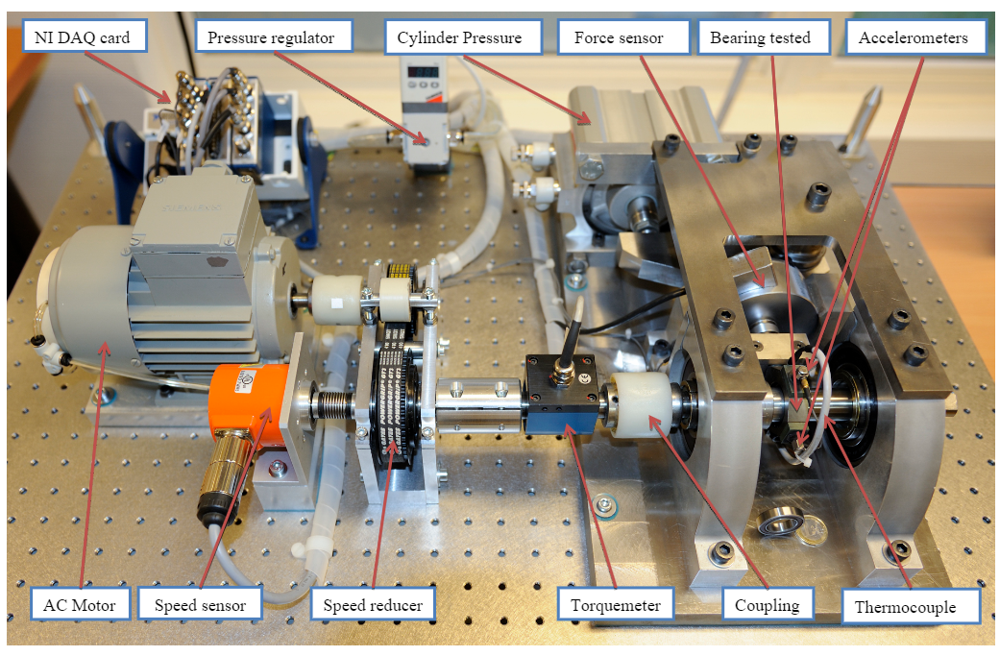 |
| :--- | :--- |

---

### HUST (Hanoi University of Science and Technology)

| **Overview:** A fault diagnosis dataset covering five bearing types.  **Experimental Setup:** Data was collected from a purpose-built testbench. Artificially induced faults include cracks and combination faults (e.g., inner race + ball).  **Data Characteristics:** Contains 99 raw vibration signals, each sampled at 51.2 kHz for 10 seconds.  **Caveat:** The paper states 27 defective and 3 healthy bearings, but the Mendeley files include healthy recordings for all five bearing types (33 condition–type combinations).  **Operating Conditions:** Experiments cover five different bearing types under three different motor loads.  **Source:** [Mendeley Data](https://data.mendeley.com/datasets/cbv7jyx4p9/1) \| [Publication (BMC Research Notes, 2023)](https://doi.org/10.1186/s13104-023-06400-4) |  |
| :--- | :--- |

---

### Politecnico di Torino (DIRG)

| **Overview:** An open-access dataset from the Dynamic and Identification Research Group (DIRG) aeronautical bearing test rig, covering speeds up to 30,000 RPM and an endurance test of about 230 hours.  **Experimental Setup:** A high-speed spindle drives a hollow shaft supported by two identical roller bearings (B1, B3); B1 carries the damage. A central bearing (B2) is loaded radially through a sledge. Damage consists of indentations on a roller or on the inner ring at three severities (150, 250, 450 µm) plus healthy.  **Data Characteristics:** Two triaxial accelerometers on the B1 and B2 supports.  **Operating Conditions:** Stationary acquisitions at speeds of 0–500 Hz (up to 30,000 RPM) and radial loads of 0–1800 N, plus an endurance acquisition of about 230 hours on the 450 µm roller indentation.  **Source:** [Zenodo (DOI: 10.5281/zenodo.3559552)](https://doi.org/10.5281/zenodo.3559552) \| [Publication (MSSP, 2019)](https://doi.org/10.1016/j.ymssp.2018.10.010) | 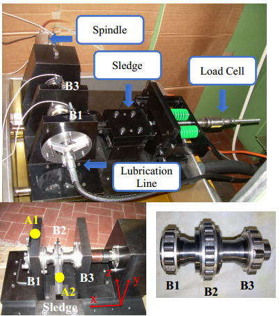 |
| :--- | :--- |

---

### Jiangnan University (JNU)

| **Overview:** A fault diagnosis dataset with artificially induced faults recorded at three rotational speeds.  **Experimental Setup:** Data was collected from a test rig using a single accelerometer. Faults were simulated by creating dents on bearing components via wire-cutting. The linked paper uses an NU205 bearing for the inner-race fault and N205 bearings for the other conditions, and its defect sizes differ from those in the GitHub README, so it may not describe these files exactly.  **Data Characteristics:** Contains vibration signals sampled at 50 kHz, provided in `.csv` format.  **Operating Conditions:** Experiments were conducted under three distinct rotational speeds: 600, 800, and 1000 RPM.  **Source:** [GitHub Repository](https://github.com/ClarkGableWang/JNU-Bearing-Dataset) \| [Publication (Sensors, 2013)](https://doi.org/10.3390/s130608013) | 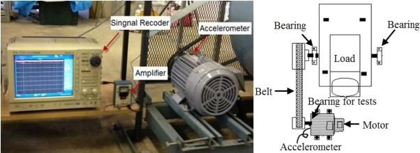 |
| :--- | :--- |

---

### University of New South Wales (UNSW)

| **Overview:** Run-to-failure data recorded to track the natural evolution of spalls, for bearing fault severity assessment.  **Experimental Setup:** Contains data from four separate run-to-failure experiments where spall damage developed naturally under operational stress.  **Data Characteristics:** Contains horizontal and vertical acceleration signals and an encoder signal, provided in `.mat` format.  **Operating Conditions:** Data was collected at multiple speeds throughout the run-to-failure tests.  **Source:** [Mendeley Data](https://data.mendeley.com/datasets/h4df4mgrfb/3) \| [Publication (MSSP, 2022)](https://doi.org/10.1016/j.ymssp.2021.108466) | 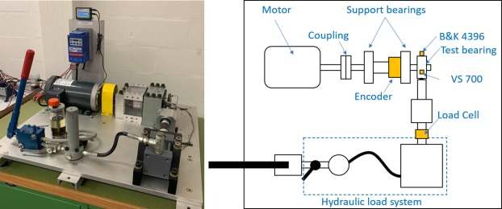 |
| :--- | :--- |

---

### SDOL (Korea Aerospace University)

* **Overview:** A diagnostics dataset for cylindrical roller bearings from the System Design Optimization Lab (SDOL) at Korea Aerospace University.
* **Experimental Setup:** A testbed consisting of a DC motor, support bearings, and two test roller bearings (NSK NJ 2306). A vertical load is applied through the support bearing.
* **Data Characteristics:** Vibration signals sampled at 51.2 kHz.
* **Operating Conditions:** Constant shaft speed of 1200 RPM.
* **Caveat:** The download contains two single-channel recordings (about 1 s and 2.4 s) from one bearing with a seeded inner-race notch and no healthy recording. It is an example for envelope analysis rather than a full diagnosis dataset.
* **Source:** [SDOL Bearing Datasets](https://www.kau-sdol.com/bearing) | [Publication (Applied Sciences, 2020)](https://doi.org/10.3390/app10207302)

---

### Machinery Failure Prevention Technology (MFPT)
* **Overview:** Data from a laboratory test rig combined with fault data from real machinery.
* **Experimental Setup:** Includes baseline and artificial fault data from a test rig, alongside real-world fault data from components such as wind turbine bearings.
* **Data Characteristics:** Primarily vibration signals in `.mat` format, with high sampling rates for the test rig data.
* **Operating Conditions:** The test rig data was collected at a constant speed (25 Hz) with a range of different loads. Real-world conditions vary by application.
* **Access:** The original MFPT Society page (mfpt.org/fault-data-sets) now redirects to an ASNT affiliate page with no data; the files are available only through third-party mirrors.
* **Source:** [MFPT Society (archived link)](https://www.mfpt.org/fault-data-sets/)

---

### MAFAULDA (Machinery Fault Database)

| **Overview:** A machinery fault database that includes imbalance and misalignment faults in addition to bearing faults.  **Experimental Setup:** Data was generated on a SpectraQuest Machinery Fault Simulator, covering normal operation and various fault types.  **Data Characteristics:** The dataset is multi-modal, with each recording containing 8 channels: a tachometer signal, 3-axis acceleration for two bearings, and a microphone for acoustic signals.  **Operating Conditions:** Covers a range of operating conditions specific to individual experimental files.  **Source:** [UFRJ Website](https://www02.smt.ufrj.br/~offshore/mfs/page_01.html) \| [Commonly Cited Paper (SBrT, 2017)](https://doi.org/10.14209/sbrt.2017.133) | 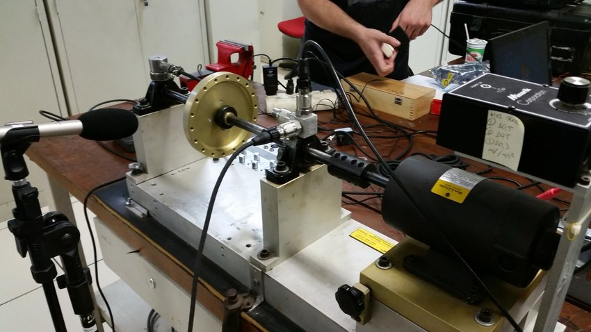 |
| :--- | :--- |

---

### PHM09 Gearbox
* **Overview:** The basis for the 2009 PHM Society Data Challenge, this dataset covers a multi-stage gearbox in which bearing faults are one of several fault types.
* **Experimental Setup:** Data was collected from a generic industrial gearbox test rig with multiple shafts, gears, and bearings, including various gear and bearing fault conditions.
* **Data Characteristics:** Data was collected synchronously from accelerometers and a tachometer, with a sampling frequency of 66.67 kHz.
* **Operating Conditions:** Data was collected at five different shaft speeds under both high and low load conditions.
* **Source:** [PHM Society Public Data Sets](https://phmsociety.org/public-data-sets/) | [Commonly Cited Paper (IJPHM, 2011)](https://doi.org/10.36001/ijphm.2011.v2i1.1339)

---

### SDUST Bearing and Gear

Bearing and planetary-gearbox fault data from a transmission fault-implantation test rig at Shandong University of Science and Technology. The bearing subset uses 6205 bearings in 10 states: normal, plus inner race, outer race and rolling element faults at 0.2, 0.4 and 0.6 mm. It covers six constant speeds (1000-3000 rpm), three speed-varying ranges (800-1500, 1000-2000 and 1500-2500 rpm) and four load levels (0-60). Two triaxial accelerometers (6 channels) record 40 s at 25.6 kHz with an LMS Test.Lab system. A gear subset with planet and sun gear pitting, crack and wear faults is included.

* **Bearing:** 6205 deep groove ball bearing
* **Sampling Rate:** 25.6 kHz
* **Operating Conditions:** Constant speeds 1000/1500/1800/2000/2500/3000 rpm and time-varying speeds 800-1500, 1000-2000, 1500-2500 rpm; loads 0/20/40/60 (N per the dataset PDF); 40 s records
* **License:** none stated (no licence in GitHub repo; the dataset PDF says the data are public and anyone may use them to verify diagnosis algorithms, citing the listed papers)
* **Caveats:** No dataset paper; the repository asks users to cite the group's method papers (the first one is linked). No licence stated. The repository also contains a 1797 rpm, no-load file for each state that the PDF does not describe.
* **Source:** [GitHub](https://github.com/JRWang-SDUST/SDUST-Dataset) \| [Publication](https://doi.org/10.1016/j.knosys.2023.111285)
---

### HIT Inter-Shaft Bearing (Aero-Engine)

Inter-shaft bearing fault data from a test rig built around a real dual-rotor aero-engine driven by LP and HP motors, rather than from a bearing test bench. Three bearings with wire-cut faults (one outer ring, two inner ring sizes) and a healthy bearing were fitted in turn and run at 28 LP/HP speed combinations (LP 1000-5000 r/min, HP 1200-6000 r/min). Six channels are recorded at 25 kHz: two eddy-current displacement sensors on the LP rotor and four accelerometers on the casings, supplied as 20,480-point segments with speed and label columns.

* **Bearing:** Aero-engine inter-shaft bearing (15 rolling elements, 7.5 mm; 30 mm inner / 65 mm outer ring diameter; model not stated)
* **Sampling Rate:** 25 kHz
* **Operating Conditions:** 28 low/high-pressure rotor speed combinations (LP 1000-5000 r/min, HP 1200-6000 r/min, speed ratio 1.2-1.8)
* **License:** none stated (no licence in GitHub repo or on the Google Drive folder; the paper itself is CC BY 4.0)
* **Caveats:** The GitHub repository holds only channel 1 as train/test splits; the full data (all channels) are in the Google Drive folder linked from the repository. No data licence stated. Distinct from the HIT-SM dataset.
* **Source:** [GitHub](https://github.com/HouLeiHIT/HIT-dataset) \| [Publication](https://doi.org/10.37965/jdmd.2023.314)
---

### MCC5-THU Gearbox

Vibration dataset from a two-stage parallel gearbox driven by a 2.2 kW induction motor, loaded by a magnetic powder brake, recorded under time-varying speed and time-varying load. States include healthy, five gear faults (missing tooth, wear, pitting, crack, break) and two compound faults combining a broken tooth with an inner- or outer-race fault (0.1/0.3/0.5 mm) on the ER16K intermediate-shaft bearing. Each of the 240 CSV files holds 60 s of triaxial vibration at the motor drive end and gearbox intermediate-shaft bearing seat, plus input torque and a key-phase speed signal, sampled at 12.8 kHz.

* **Bearing:** ER16K deep-groove ball bearing (intermediate-shaft support bearing; 9 balls, 0.3125 in ball dia., 1.516 in pitch dia.)
* **Sampling Rate:** 12.8 kHz
* **Operating Conditions:** Time-varying speed (0-1000/2000/3000 rpm profiles at 10 or 20 Nm) and time-varying load (0-10/20 Nm at 1000/2000/3000 rpm); 60 s per file
* **License:** CC BY 4.0
* **Caveats:** Bearing faults appear only combined with gear tooth breakage (2 of 8 fault types); there is no bearing-only class. Sibling of the MCC5-THU Motor dataset.
* **Source:** [Mendeley](https://doi.org/10.17632/p92gj2732w.2) \| [Publication](https://doi.org/10.1016/j.dib.2024.110453)
---

### SUSU Shaft-Mounted Wireless Sensor

Bearing fault data recorded with a wireless acceleration sensor mounted directly on the rotating shaft, measuring both linear and angular acceleration. The test rig has a 1-inch shaft on two ER-16K bearings driven by an AC motor. Five test bearings were used: healthy, inner race, outer race, ball, and one with all three faults, with damage made by a rotary tool. Signals are sampled at 31.175 kHz at 1200 rpm (20 Hz), and the repository adds an 18 Hz set.

* **Bearing:** ER-16K (MB Manufacturing), 1-inch shaft
* **Sampling Rate:** 31.175 kHz
* **Operating Conditions:** 1200 rpm (20 Hz) as described in the paper; the repo also contains an 18 Hz set
* **License:** none stated (no licence in GitHub repo)
* **Caveats:** The repository also contains an 18 Hz subset that is not described in the paper or README. No licence stated.
* **Source:** [GitHub](https://github.com/SUSU-CM/Bearings-dataset) \| [Publication](https://doi.org/10.1016/j.ymssp.2022.109454)
---

### NEEPU Bearing Dataset

Bearing vibration data released with the paper 'You can get smaller' (Advanced Engineering Informatics, 2023) from Northeast Electric Power University. Seven classes: healthy, inner race, outer race and ball faults, plus the compound ball+outer, ball+inner and outer+inner faults. Race faults are 1.0 mm wide x 0.3 mm deep gaps and ball faults are 1.0 mm x 0.3 mm holes. Four load levels (0-0.3 N·m) are applied by a magnetic brake. The data are the sensor voltage signals divided by 5, supplied as a single .mat file.

* **Operating Conditions:** Loads 0.0, 0.1, 0.2, 0.3 N·m applied by a magnetic brake
* **License:** Unknown (as set on Kaggle)
* **Caveats:** Uploaded to Kaggle by a paper co-author; Kaggle licence "Unknown". The paper is closed access, so sampling rate and bearing type could not be verified.
* **Source:** [Kaggle](https://www.kaggle.com/datasets/fushangdaren/bearing-dataset-of-you-can-get-smaller) \| [Publication](https://doi.org/10.1016/j.aei.2023.101890)
---

### SQ Variable-Speed Bearing (SQV)

Vibration data for bearing fault diagnosis under continuously varying speed, recorded on a SpectraQuest machinery fault simulator. The test bearing is an NSK 6203 at the motor drive end. Seven health states: normal, plus inner race and outer race single-point defects at three severity levels. Each record covers a full run-up from standstill to 3000 rpm, a hold and a run-down to 0 rpm. Vibration and a speed-pulse channel are recorded at 25.6 kHz with a CoCo-80 analyser.

* **Bearing:** NSK 6203 (motor drive end)
* **Sampling Rate:** 25.6 kHz
* **Operating Conditions:** Continuous speed variation: run-up from standstill to 3000 rpm, hold, run-down to 0, controlled by hand; 6-10 repeated runs per class
* **License:** none stated (no licence in GitHub repo)
* **Caveats:** The paper is closed access; the files were recorded in 2015. No licence stated.
* **Source:** [GitHub](https://github.com/shenliuuu/SQ-dataset-with-variable-speed-for-fault-diagnosis) \| [Publication](https://doi.org/10.1016/j.ymssp.2022.110071)
---

### NLN-EMP Navy E-Motor Pump

Condition-monitoring data from two induction-motor-driven centrifugal pumps (VFD-fed) at Fieldlab Techport, IJmuiden, collected by the Royal Netherlands Navy. One fault is present at a time; bearing faults on the 4-pole set include motor NDE outer- and inner-race defects (1, 2 or 3 milled axial lines, 1 mm wide x 350 um deep) at three severities, a damaged rolling element, grease contaminated with iron filings, and a pump NDE outer-race defect (which, per the data paper, also has accidental inner-ring damage from assembly), alongside electrical, alignment, unbalance, impeller, coupling and cavitation faults. Five single-axis accelerometers on the motor and pump bearing housings and three-phase current and voltage are recorded at 20 kHz. Set 2 runs at 50, 75 and 100% of rated speed and set 4 at 70%.

* **Bearing:** Deep groove ball bearings: motor 2 NDE 6309.C4 (motor faults); pump 2 NDE 6308.2Z.C3 (pump fault). Other set-up: motor 6310.C4, pump 6306.2Z.C3
* **Sampling Rate:** 20 kHz (vibration and current/voltage)
* **Operating Conditions:** Motor-pump set 2 (11 kW, 4-pole) at 50/75/100% rated speed; set 4 (22 kW, 2-pole) at 70% only; VFD-driven; fresh-water circuit
* **License:** CC0 1.0
* **Caveats:** Faults were induced on industrial-size pumps at a field lab; they are not natural field failures. Bearing faults are one group among about 11 fault classes.
* **Source:** [4TU.ResearchData](https://doi.org/10.4121/2b61183e-c14f-4131-829b-cc4822c369d0) \| [Publication](https://doi.org/10.1016/j.dib.2023.109987)
---

### Siemens 2 MW Wind Turbine SCADA

Thirty days (November 2012) of 10-minute SCADA data from one 2 MW Siemens wind turbine drivetrain on the Baltic coast of northern Poland. It has 12 parameters: wind, rotor and generator speed, active and reactive power, generator voltage and current, gearbox bearing temperature and two generator temperatures. A gearbox bearing failure was recorded on 9 Nov 2012 at 13:00, so the data covers normal operation and the period before the fault. The data has been used in a series of papers on cointegration and stationarity-based fault detection.

* **Bearing:** Gearbox bearing (position not specified); SCADA column is 'gearbox bearing temperature'
* **Sampling Rate:** 10-min averages
* **Operating Conditions:** One 2 MW Siemens turbine; 1-30 Nov 2012; 4,320 samples, 12 parameters
* **License:** CC BY 4.0
* **Caveats:** A single gearbox bearing failure (9 Nov 2012), stage not given; no label column.
* **Source:** [Mendeley](https://doi.org/10.17632/3sys4562ny) \| [Publication](https://doi.org/10.1016/j.renene.2017.06.089)

---

### UOEMD-VAFCVS

Induction-motor fault dataset from the University of Ottawa, recorded on a modified SpectraQuest Machinery Fault Simulator with eight 3 HP Marathon D396 motors, one healthy and seven each carrying one SpectraQuest-made fault. Classes are healthy, rotor unbalance, misalignment, stator winding fault, voltage unbalance/single phasing, bowed rotor, broken rotor bars and faulty bearings. Three accelerometers, a microphone and a temperature sensor are sampled at 42 kHz for 10 s. Runs cover four constant speeds (15-60 Hz) and four speed ramps, unloaded and loaded (128 recordings).

* **Bearing:** 6205 (motor bearings, Marathon Electric D396); faulty-bearing defect type not stated
* **Sampling Rate:** 42 kHz
* **Operating Conditions:** Constant 15/30/45/60 Hz; ramps 15-45, 30-60, 45-15, 60-30 Hz; unloaded and loaded (bolted disk); 10 s per file
* **License:** CC BY 4.0
* **Caveats:** Each fault class is a different physical motor, so motor identity is confounded with the label.
* **Source:** [Mendeley](https://doi.org/10.17632/msxs4vj48g.2) \| [Publication](https://doi.org/10.1016/j.dib.2024.110144)

---

### URMA-CRTI

Vibration data from the bearing test bench of the CRTI research unit in Annaba, Algeria (formerly URMA). A 0.37 kW induction motor driven by a Lenze variable-speed drive runs with the tested bearing on the drive side; three ICP accelerometers (CTC AC140-2D, 100 mV/g) record the signals. The bearing states are healthy, outer race, inner race, ball and combined faults, recorded at supply frequencies from 30 to 50 Hz, for 10 s at 25.6 kHz, in one MATLAB file.

* **Bearing:** Deep groove ball bearing ER12K (per related paper)
* **Sampling Rate:** 25.6 kHz
* **Operating Conditions:** 0.37 kW three-phase induction motor; VFD supply frequencies 30, 35, 40, 45, 50 Hz; 10 s per condition
* **License:** CC BY 4.0
* **Source:** [Zenodo](https://doi.org/10.5281/zenodo.19109149) \| [Publication](https://doi.org/10.1007/s00170-019-04726-7)

---

### Lenze-MB

Bearing fault dataset from Lenze SE recorded only with signals already available in an industrial drive: a Lenze i950 inverter feeding a PMSM with a SinCos encoder. Test bearings (FAG NU2205 cylindrical roller) sit in pedestals on the driven shaft, with a belt-coupled load machine applying radial force and load torque. Classes are healthy, five levels of inner-ring pitting and one heavy artificial inner-ring defect. Phase currents and voltages, DC-bus voltage, encoder angle and speed are logged at 16 kHz at four speeds (900-1500 rpm), two load torques and two belt tensions.

* **Bearing:** FAG NU2205-E-XL-TVP2 (cylindrical roller bearing)
* **Sampling Rate:** 16 kHz
* **Operating Conditions:** Speeds 900/1000/1375/1500 rpm; load torque 0 or 2 Nm; belt tension 250 or 500 N (stated as Nm) giving radial load; 112 measurements
* **License:** CC BY-NC 4.0
* **Caveats:** Bearing faults only (no other motor faults); no external sensors. Measurement IDs in Meta_Data.xlsx run in one contiguous block per class, so class coincides with recording session.
* **Source:** [Zenodo](https://doi.org/10.5281/zenodo.14762422) \| [Publication](https://doi.org/10.1016/j.engappai.2023.106834)

---

## Diagnosis — Vibration (Laboratory)

### Politecnico di Torino (ISED)

* **Overview:** A dataset of medium-to-large spherical roller bearings of the type used in heavy industrial applications.
* **Experimental Setup:** Data was collected by the ISED group on a medium/large-scale test rig (bearings up to 420 mm outer diameter) using SKF 22240 CCK/W33 spherical roller bearings. Localized defects (2 mm diameter, 0.5 mm deep) were introduced on the inner race, outer race, or a roller.
* **Data Characteristics:** The dataset is multi-modal, containing vibration, temperature, and speed measurements in `.mat` format, organized into undamaged, inner race, outer race, and roller damage folders. Four accelerometers and four temperature sensors (one per bearing) are sampled at 20.48 kHz in 30 s acquisitions.
* **Operating Conditions:** 10 nominal rotational speeds (127–997 RPM) and four load conditions (one including axial load), plus some speed-ramp recordings.
* **Caveat:** In all damaged tests the defective bearing is at position 4, so bearing position coincides with the damage label.
* **Access:** Distributed under a *Restricted Use Agreement*, not an open license.
* **Source:** [Zenodo (DOI: 10.5281/zenodo.13913253)](https://doi.org/10.5281/zenodo.13913253) | [Polito IRIS record](https://iris.polito.it/handle/11583/2993655) | [Test Rig Publication (Machines, 2022)](https://doi.org/10.3390/machines10010054) | [Publication (Sensors, 2023)](https://doi.org/10.3390/s23010211)

---

### Politecnico di Torino (ISED) Multiple Defects

* **Overview:** A follow-up to the ISED spherical roller bearing dataset with multiple simultaneous defects.
* **Experimental Setup:** Same medium/large-scale ISED test rig and SKF 22240 CCK/W33 bearings. Three configurations: two inner race defects 180° apart on one bearing (2 mm and 1 mm diameter, 0.5 mm deep); an outer race defect on a second bearing combined with the dual inner race defects; and an outer race defect combined with a rolling-element defect on a second bearing.
* **Data Characteristics:** Vibration, temperature, and speed measurements in `.mat` format.
* **Operating Conditions:** 10 nominal rotational speeds and four load conditions (one including axial load), plus some speed-ramp recordings.
* **Access:** Distributed under a *Restricted Use Agreement*, not an open license.
* **Source:** [Zenodo (DOI: 10.5281/zenodo.14856937)](https://doi.org/10.5281/zenodo.14856937) | [Test Rig Publication (Machines, 2022)](https://doi.org/10.3390/machines10010054)
---

### German Aerospace Center (DLR)

| **Overview:** A dataset recorded for fault size estimation research, using axial ball bearings under operating conditions relevant to aerospace applications.  **Experimental Setup:** Data was collected using an axially loaded FAG QJ212TVP four-point-contact ball bearing. Spalls emulating fatigue damage were machined by spark erosion (EDM) at three sizes on the inner race and three on the outer race, plus a healthy bearing.  **Data Characteristics:** Contains 28 time-series vibration measurements (30 s each, one accelerometer), each sampled at 25.6 kHz.  **Operating Conditions:** Two rotational speeds (60 and 500 RPM) and two axial loads (5.0 and 8.8 kN).  **Source:** [Mendeley Data](https://data.mendeley.com/datasets/chwhh9n3bf/1) \| [Publication (Data in Brief, 2023)](https://doi.org/10.1016/j.dib.2023.109019) | 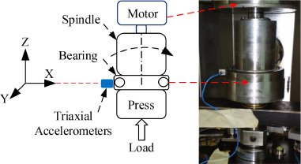 |
| :--- | :--- |

---

### University of Seoul (UOS) Multi-Domain Compound Faults

| **Overview:** A multi-domain vibration dataset built for cross-domain diagnosis, combining several bearing types with single, rotating-component, and compound machine faults.  **Experimental Setup:** Three bearing types were tested (one Mendeley record per type; subset 1 is the MOCHU 6204 deep-groove ball bearing). In the cylindrical roller subset, the inner-race fault uses an NTN NJ204 bearing and the other conditions an NTN N204, so bearing model coincides with the inner-race label. The 31 fault classes are 3 single bearing faults (ball, inner race, outer race), 7 single rotating-component faults (misalignment and unbalance at three severities each, plus looseness), and 21 compound combinations.  **Data Characteristics:** Vibration signals recorded for 160 s at 8 kHz and 80 s at 16 kHz (1,280,000 samples each), provided as raw signals and spectrograms in `.mat` format.  **Operating Conditions:** Six rotational speeds (600–1600 RPM).  **Source:** [Paper (Data in Brief, 2024)](https://doi.org/10.1016/j.dib.2024.110940) \| Mendeley Data: [53vtnjy6c6](https://data.mendeley.com/datasets/53vtnjy6c6) \| [7trwzz77xh](https://data.mendeley.com/datasets/7trwzz77xh) \| [2cygy6y4rk](https://data.mendeley.com/datasets/2cygy6y4rk) | 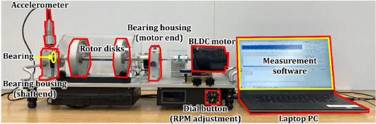
| :--- | :--- |

---

### Harbin Institute of Technology (HIT-SM)

| **Overview:** A dataset recorded for cross-domain fault diagnosis and transfer learning research.  **Experimental Setup:** Composed of two sub-datasets from two physically different test rigs (SpectraQuest MFS and a self-built rig) with identical fault types and bearing models.  **Data Characteristics:** Contains vertical vibration signals collected at a sampling frequency of 51.2 kHz for both rigs.  **Operating Conditions:** For both test rigs, data was collected at three identical driving speeds: 600, 900, and 1200 RPM.  **Source:** [GitHub Repository](https://github.com/hitwzc/Bearing-datasets) \| [Publication (Meas. Sci. Technol., 2022)](https://doi.org/10.1088/1361-6501/ac7941) | 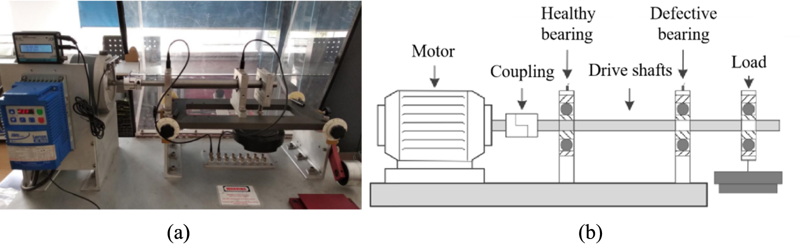 |
| :--- | :--- |

---

### Vishwakarma Institute of Technology (VIT)

* **Overview:** A rolling-element bearing vibration dataset collected under controlled static load and motion conditions.
* **Experimental Setup:** Data was collected from a test rig using two accelerometers (horizontal and vertical). Bearing conditions include healthy, inner race fault (IRF), and outer race fault (ORF). Each condition was tested with and without load at three different motor speeds.
* **Data Characteristics:** Contains 50 files of vibration data, all sampled at 12 kHz over 6-second windows. Data is provided in MATLAB-compatible format via Mendeley.
* **Operating Conditions:** Experiments were conducted at three rotational speeds (950, 1250, and 1950 RPM) under loaded and unloaded conditions.
* **Caveat:** The paper names a 608-2RSH bearing, but its bearing geometry table (pitch diameter 1.537 in, ball diameter 0.3126 in) matches a 6205. It also gives two different defect sizes (0.8 × 0.7 mm in the text, 0.3 × 0.5 mm in the equipment table).
* **Source:** [Mendeley Data (DOI: 10.17632/zgzyxdnyv9.2)](https://data.mendeley.com/datasets/zgzyxdnyv9/2) | [Publication (Data in Brief, 2025)](https://doi.org/10.1016/j.dib.2025.111455)

---

### University of Arkansas (Single & Double Faults)

* **Overview:** A vibration dataset for classifying single and compound (simultaneous) faults in rotary machines.
* **Experimental Setup:** Data was collected from a SpectraQuest fault simulator using accelerometers on bearing housings. Faulty components are bearings with inner raceway, outer raceway, ball, and combined ball and raceway faults (one bearing each, placeable at either support), and two bent shafts (bent at the centre and near the coupling).
* **Data Characteristics:** Contains 39 fault scenarios (38 single and double fault combinations plus 1 healthy baseline) at three different operating frequencies, for a total of 114 CSV files (about 15 GB). Each scenario was recorded 25 times by 8 piezoelectric accelerometers at 6,400 Hz for about 10 seconds.
* **Operating Conditions:** Three shaft speeds, listed in the data record as 25, 50, and 75 "rpm". The paper does not give numeric values; on a SpectraQuest simulator these are most likely 25/50/75 Hz setpoints (1500/3000/4500 RPM).
* **Source:** [figshare (DOI: 10.6084/m9.figshare.22693120)](https://doi.org/10.6084/m9.figshare.22693120) | [Publication (Data in Brief, 2023)](https://doi.org/10.1016/j.dib.2023.109358)

---

### NUST ICE Journal Bearing

* **Overview:** Vibration signatures from main journal (sliding) bearings of an internal combustion engine, recorded under different climatic and operating conditions.
* **Experimental Setup:** A tri-axial accelerometer was mounted on the journal bearing housing of an internal combustion engine. The engine was exposed to various climatic conditions (temperature and humidity variations) following MIL-STD-810G, and tested at different engine rotation speeds inside a climatic and vibration chamber.
* **Data Characteristics:** Comprises more than 500 files covering a range of climatic and operational conditions, including both healthy and faulty bearing states, with root mean square (RMS) values included.
* **Operating Conditions:** The dataset includes variations in environmental temperature, humidity, and engine rotation speed, simulating real-world environmental conditions that affect bearing performance.
* **Caveat:** The files are mostly processed VibrationVIEW reports (acceleration waveform, ASD, RMS, kurtosis) at a 3.2 kHz test frequency rather than raw high-rate signals. All healthy tests were run before the faulty bearing was installed.
* **Source:** [Mendeley Data (DOI: 10.17632/3fcrrdjjvk)](https://doi.org/10.17632/3fcrrdjjvk) | [Publication (Data in Brief, 2025)](https://doi.org/10.1016/j.dib.2024.111214)

---

### BJTU-RAO Bogie Dataset

* **Overview:** A fault dataset for subway train bogie transmission systems, introduced at the 2024 Global Reliability and Prognostics and Health Management (PHM) Conference. It covers 1 healthy state and 50 faulty states. While it extends beyond bearings to the broader drivetrain, bearing faults are a key component of the fault scenarios.
* **Experimental Setup:** Data was acquired through fault simulation experiments on a subway train bogie transmission system test rig at Beijing Jiaotong University, in collaboration with the Rail Autonomous Operations (RAO) program.
* **Data Characteristics:** Contains multi-sensor data streams covering 51 conditions (1 healthy + 50 faulty states), for multi-class fault classification and transfer learning research.
* **Operating Conditions:** The dataset covers a wide variety of fault types and severities representative of real subway train operating scenarios.
* **Source:** [Publication (IEEE Access, 2025, DOI: 10.1109/ACCESS.2025.3551603)](https://doi.org/10.1109/ACCESS.2025.3551603) | [Data (Google Drive, linked from community repositories, not verified against the paper)](https://drive.google.com/drive/folders/1RlZvFw-v07VvsL2Ni9cS7iFrTPDIhn2r)

---

### HAUST-LDV

Deep groove ball bearing (6206) vibration measured without contact by a Polytec laser Doppler vibrometer aimed at the outer ring, on an SKF precision vibration test platform with pneumatic axial and radial loading. Ten bearing states (healthy plus three sizes each of inner race, outer race and rolling element pitting) are recorded under two load cases, giving 20 CSV files. Each is a 34 s recording at 1800 rpm sampled at 48 kHz.

* **Bearing:** SKF 6206 deep groove ball bearing
* **Sampling Rate:** 48 kHz
* **Operating Conditions:** 1800 rpm constant; 2 loads: A = 100 N axial / 0 N radial, B = 100 N axial / 50 N radial
* **License:** CC BY 4.0
* **Source:** [Mendeley](https://doi.org/10.17632/3d5kcz83ny.1)

---

### AITHE Bearing Dataset

Vibration data from a belt-driven rotating machinery fault simulator at the Ahrar Institute of Technology and Higher Education (Iran) with NU 204 ECP cylindrical roller bearings. There are nine classes: healthy, several inner race and outer race groove or wear defects, a combined inner and outer race defect, and rotor unbalance. Signals were recorded with one accelerometer at 17.85 kHz and 1900 rpm, and are provided as 178 short segments (3571 samples each) with a label file.

* **Bearing:** NU 204 ECP cylindrical roller bearing
* **Sampling Rate:** 17.85 kHz
* **Operating Conditions:** 1900 rpm constant; belt-driven rig (2:1 pulley), 0.5 hp motor
* **License:** CC BY 4.0
* **Caveats:** 178 segments of about 0.2 s. One of the 9 classes is rotor unbalance rather than a bearing fault.
* **Source:** [Mendeley](https://doi.org/10.17632/6x5s5hm6kr.1) \| [Publication](https://doi.org/10.1007/s00500-021-06307-x)

---

### Tecnalia Bearing, Variable Conditions

Machinery-fault-simulator test rig (motor, shaft on inboard and outboard bearings, gearbox) used to compare a healthy bearing with an MB ER-12K inboard bearing that has an outer race defect, at a constant 50 Hz shaft speed and under a variable-speed ramp profile. There are four 10 s tests. Each has 16 channels sampled at 20.48 kHz: tachometer, triaxial and biaxial accelerometers on the motor and bearing housings, gearbox accelerometers, proximity probes and motor currents. Calibration factors are given in each file.

* **Bearing:** MB ER-12K
* **Sampling Rate:** 20.48 kHz
* **Operating Conditions:** Constant 50 Hz shaft speed; variable-speed ramps through 14.2, 23.4 and 17.6 Hz; 10 s per test
* **License:** CC BY 4.0
* **Caveats:** 4 files of 10 s: healthy and outer race defect. Companion to the Tecnalia gearbox dataset.
* **Source:** [Mendeley](https://doi.org/10.17632/sp3fbf8d9y.1)

---

### Tecnalia Gearbox, Variable Conditions

Two-stage test gearbox driven by a speed-controlled AC motor and loaded by a torque-controlled motor through a second gearbox. Tests cover a healthy baseline, a broken gear tooth, an outer race fault in the ER-16KCL input bearing, and combined gear and bearing faults, under stationary, variable-speed, variable-load and combined conditions. Each 10 s test records 16 channels at 20.48 kHz: 8 accelerometers, tachometer, two encoders, torque, two motor currents and the bearing axial force.

* **Bearing:** ER-16KCL (Test Gearbox input bearing)
* **Sampling Rate:** 20.48 kHz
* **Operating Conditions:** Stationary 1500 rpm / 70% load; speed ramp 840-1400-1000 rpm at 70% load; load ramp 20-80-50% at 1500 rpm; combined speed and load variation; 10 s per test
* **License:** CC BY 4.0
* **Caveats:** Conditions: healthy, broken gear tooth, bearing outer race fault, and combined gear and bearing fault. Tests 9 and 13 (bearing fault under variable speed) are missing from the release. Sampling rate (20.48 kHz) is taken from the file headers.
* **Source:** [Mendeley](https://doi.org/10.17632/whj3wxhw8j.1)

---

### UC204 Outer Race Fault, Variable Load

Vibration signals from a UC204 insert ball bearing, healthy and with artificial outer race grooves of four lengths (0.18 to 0.72 mm), at about 1500 rpm under three load levels (0.25, 0.4 and 0.6 hp). Data were recorded with an ADXL210 accelerometer and an NI USB-6212 at 3.2 kHz, with ten 10 s text files per condition (150 files).

* **Bearing:** UC204 insert ball bearing (GBR)
* **Sampling Rate:** 3.2 kHz
* **Operating Conditions:** ~1500 rpm constant; 3 loads: 0.25, 0.4, 0.6 hp
* **License:** CC BY 4.0
* **Caveats:** Mendeley record szfkx3mzcm is a byte-identical duplicate.
* **Source:** [Mendeley](https://doi.org/10.17632/95ybrwzhm8.1)

---

### JUST Slewing Bearing

Low-speed slewing bearing fault test data with one healthy slewing bearing and three with a single fault (inner ring, outer ring, one rolling element). Tests cover nine working conditions combining 2, 6 and 12 rpm with three overturning-force levels, with five recordings per state and condition. Each CSV has six accelerometer channels (four vertical, two horizontal) and one acoustic channel, sampled at 50 kHz.

* **Bearing:** Slewing bearing (model not stated)
* **Sampling Rate:** 50 kHz
* **Operating Conditions:** 9 conditions: 2, 6, 12 rpm x overturning force 0, 30, 60 (labelled 'N')
* **License:** CC BY 4.0
* **Caveats:** Sampling rate (50 kHz) is taken from the time column. The channel described as acoustic emission is labelled "AI 7 (dB)" in the files.
* **Source:** [Mendeley (conditions 1–6)](https://doi.org/10.17632/hwg8v5j8t6.1) \| [Mendeley (conditions 7–9)](https://doi.org/10.17632/rcxgmdxhbr) \| [Publication](https://doi.org/10.12382/bgxb.2023.0756)

---

### VibroBox Bearing Datasets

Five Mendeley records from VibroBox R&D (Minsk). They cover vibration acceleration of a normal and a faulty ball bearing (analogous to 6213) on the same test stand, recorded as 96 kHz WAV files with a stud-mounted accelerometer. The records differ in speed regime: constant 973 rpm (40 signals), constant 800-900 rpm with the faulty bearing only (105 signals), constant 50-900 rpm (36), moderately varying speed around 650-975 rpm (44), and widely varying speed over 0-900 rpm with random, ramp and triangle profiles (79). The two varying-speed records include a synchronized tachometer signal as CSV.

* **Bearing:** Rolling ball bearing analogous to 6213 (the widely-varying-speed docx says only 'rolling ball bearing')
* **Sampling Rate:** 96 kHz
* **Operating Conditions:** fbf6y8m4mv: 973 rpm constant. vjzrrzm5wm: constant speed per record, 800-900 rpm in 5 rpm steps. ryg9rrkgv8: constant 50-900 rpm in 50 rpm steps. j66x27t229: moderate ramps (+/-1-10 rpm) from 650-975 rpm starting speeds. 6k6fbzc6vv: wide variation 0-900 rpm (random, linear up/down, triangle profiles)
* **License:** CC BY 4.0
* **Caveats:** No paper; how the fault was made and whether it is natural or artificial is not stated. The faulty bearing is described as having an outer-ring fault; the fbf6y8m4mv record describes it as a severe outer-ring defect together with an incipient inner-ring defect.
* **Source:** [Constant 973 rpm](https://doi.org/10.17632/fbf6y8m4mv.1) \| [Constant 800–900 rpm](https://doi.org/10.17632/vjzrrzm5wm.1) \| [Constant 50–900 rpm](https://doi.org/10.17632/ryg9rrkgv8.1) \| [Moderate ramps](https://doi.org/10.17632/j66x27t229.1) \| [Widely varying 0–900 rpm](https://doi.org/10.17632/6k6fbzc6vv.1)
---

### Army Engineering University of PLA, Mixed Bearing–Gearbox

Vibration dataset from a drivetrain fault simulator with an NU205 cylindrical roller bearing module and a parallel-shaft gearbox. It covers 15 distinct health states (16 file groups, as normal is recorded twice, once with the bearing set and once with the gearbox set): normal, five bearing crack faults (inner, outer, rolling element, cage, inner+outer), three gear faults (surface wear, broken tooth, eccentricity) and six mixed bearing-gear faults. Each state is recorded for 30 s with a triaxial accelerometer at 16 kHz, at 1200, 1800 and 2400 rpm and under a 200-2400-200 rpm speed sweep, at a constant 20 Nm load (64 CSV files).

* **Bearing:** NU205 cylindrical roller bearing
* **Sampling Rate:** 16 kHz
* **Operating Conditions:** 1200, 1800, 2400 rpm constant and 200-2400-200 rpm variable; constant load 20 Nm; 30 s per record
* **License:** CC BY 4.0
* **Source:** [Mendeley](https://doi.org/10.17632/yrms2v89p7.1) \| [Publication](https://doi.org/10.1016/j.dib.2025.112187)

---

### Saarland University Cylindrical Roller IR Damage

Dataset for studying domain shift in bearing diagnosis. Three NU206-E-XL-TVP2 cylindrical roller bearings were measured on a servo-motor test bed first undamaged and then with a small artificial inner-ring defect made with a milling cutter. Speed (4 levels up to 969 rpm), radial load (4 levels up to ~3300 N) and mounting position (4 positions) were varied by a designed experiment, giving 1,151 three-axis accelerometer recordings of 60 s at 20 kHz. Metadata record assembly deviations, temperature and humidity, and the files are organised for leave-one-group-out cross-validation.

* **Bearing:** Cylindrical roller bearing Schaeffler NU206-E-XL-TVP2 (test bearing); 1206-TVH fixed bearing, NU207-E-XL-TVP2 load bearing
* **Sampling Rate:** 20 kHz
* **Operating Conditions:** Speeds 85/392/706/969 rpm; radial load ~0/1600/2500/3300 N; 4 mounting positions (A-D); 3 sensor-mounting runs; 2 workers
* **License:** CC BY 4.0
* **Source:** [Zenodo (CSV/Python)](https://doi.org/10.5281/zenodo.15376389) \| [Zenodo (MATLAB)](https://doi.org/10.5281/zenodo.11108502) \| [Publication](https://doi.org/10.3390/data10050077)

---

### MOIRA-UNIMORE Independent Cart System

Bearing fault dataset from an independent cart (linear-motor transport) system based on the Beckhoff XTS, where the bearings both rotate and travel along the track. Inner and outer race faults of 0.25-1.5 mm width were introduced in the top and bottom guide-roller bearings of the carts. Track-mounted PCB accelerometers (nine vibration channels in total) were sampled at 50 kHz, together with cart position, following error, speed and set current, for single-cart and three-cart runs at 1000 and 2000 mm/s. The full dataset is about 400 GB, split across five Zenodo records.

* **Bearing:** Guide-roller bearings of Hepco GFX guidance system for Beckhoff XTS carts (double-row, V-groove outer race; outer race rotates)
* **Sampling Rate:** 50 kHz
* **Operating Conditions:** Nominal cart speeds 1000 and 2000 mm/s; 8 experiment types (1 or 3 carts, track section, movement type); 30 s to 2 min acquisitions; several fault orientations
* **License:** CC BY 4.0
* **Source:** [Zenodo](https://doi.org/10.5281/zenodo.14753682) \| [Part 2](https://doi.org/10.5281/zenodo.14755760) \| [Part 3](https://doi.org/10.5281/zenodo.14761242) \| [Part 4](https://doi.org/10.5281/zenodo.14764716) \| [Part 5](https://doi.org/10.5281/zenodo.14765814) \| [Publication](https://doi.org/10.3390/app15073691)

---

### NOVIC+ Motor Compound Fault

Compound-fault dataset from a motor test rig with an NSK 6205 bearing, built for multi-output classification and domain adaptation. Inner race and outer race faults (0.2 mm) are combined with rotor misalignment and unbalance at several levels, giving 36 health-state combinations. Data are 4 s segments at 25.6 kHz with 9 channels (4 vibration, 2 bearing-housing temperatures, torque, and speed before and after the gearbox). Three subsets cover sinusoidal, triangular and constant speed profiles, with and without torque load.

* **Bearing:** Deep groove ball bearing NSK 6205
* **Sampling Rate:** 25.6 kHz
* **Operating Conditions:** 3 hp Siemens induction motor with gearbox (ratio 2.07) and hysteresis brake. Subset A: sinusoidal speed (base 3000 rpm) with manually varied torque; Subset B: triangular speed (base 4000 rpm), no torque load; Subset C: 5 constant speeds 1800-3000 rpm, no torque load
* **License:** CC BY 4.0
* **Caveats:** Released only as pre-cut 4 s segments already split into train/validation/test, not raw recordings. Judging by the file names (recording_segment), the split is by segment: in subset C every test recording also has segments in the training set.
* **Source:** [Zenodo Part 1](https://doi.org/10.5281/zenodo.15742617) \| [Part 2](https://doi.org/10.5281/zenodo.15743008) \| [Part 3](https://doi.org/10.5281/zenodo.15743373) \| [Publication](https://doi.org/10.1016/j.ymssp.2025.113786)

---

### UPM CITEF Rolling Element Faults (2020)

Vibration data from the railway axlebox bearing test rig of the Railway Technology Research Centre (CITEF), Universidad Politécnica de Madrid. Rolling-element defects of four increasing depths (0.006, 0.014, 0.019, 0.027 mm) were milled into an FAG 22205E1KC3 spherical roller bearing and compared with a healthy bearing in a replicated 5 × 3 factorial design. Three accelerometers were recorded; the data were used to validate a low-cost acquisition system.

* **Bearing:** FAG 22205E1KC3 spherical roller bearing
* **Sampling Rate:** 40 kHz
* **Operating Conditions:** 200, 350, and 500 rpm; 1.4 kN load; 30 s records; 3 replicates
* **License:** CC BY 4.0
* **Caveats:** The record describes the defects as milled into a single bearing, so the severity levels appear to be successive stages on the same bearing.
* **Source:** [Zenodo](https://doi.org/10.5281/zenodo.3898941) \| [Publication (Sensors, 2020)](https://doi.org/10.3390/s20123493)

---

### UPM CITEF Combined Faults (2021)

A follow-up experiment on the UPM CITEF railway axlebox rig with combined outer race and rolling-element defects at four severity levels plus healthy, milled into an FAG 22205E1KC3 spherical roller bearing. Three accelerometers were recorded; the data were used to evaluate fault severity with contour maps.

* **Bearing:** FAG 22205E1KC3 spherical roller bearing
* **Sampling Rate:** 40 kHz
* **Operating Conditions:** 200, 350, and 500 rpm; 1.4 kN load; 45 s records; 3 replicates
* **License:** CC BY 4.0
* **Caveats:** The record describes the defects as milled into a single bearing, so the severity levels appear to be successive stages on the same bearing. A later combined-fault record (Zenodo 20761126, 2026) is restricted and could not be verified.
* **Source:** [Zenodo](https://doi.org/10.5281/zenodo.5084404) \| [Publication (Applied Sciences, 2021)](https://doi.org/10.3390/app11146452)

---

### UPM CITEF Isolated Faults (2023)

Isolated outer race, inner race, and rolling-element defects, each at four severity levels plus healthy, milled into an FAG 22205E1KC3 spherical roller bearing on the UPM CITEF railway axlebox rig, at a single speed. Three accelerometers were recorded.

* **Bearing:** FAG 22205E1KC3 spherical roller bearing
* **Sampling Rate:** 40 kHz
* **Operating Conditions:** 500 rpm; 400 kg load; 58 s records; 3 replicates of the healthy state and 1 recording per fault level (15 files)
* **License:** CC BY 4.0
* **Source:** [Zenodo](https://doi.org/10.5281/zenodo.8241763) \| [Publication (Mathematics, 2023)](https://doi.org/10.3390/math11163498)
---

### ISAC Lab Bearing and Unbalance

Vibration dataset from a rotating-machine test rig at the Intelligent Systems and Advanced Control Lab, University of Guilan. It covers healthy operation, outer race and ball faults (a defective bearing placed in each of three bearing positions) and unbalance on six disks, recorded by six sensors at 10 kHz. Healthy data were taken at shaft frequencies of 10-50 Hz and fault data at 10 and 30 Hz; startup and shutdown recordings for noise estimation are also included.

* **Sampling Rate:** 10 kHz
* **Operating Conditions:** Healthy at 10/20/30/40/50 Hz (60 s, twice); faults at 10 and 30 Hz; startup/shutdown noise recordings (20 s); healthy state has 0.02 mm shaft misalignment
* **License:** CC BY 4.0
* **Caveats:** Bearing model not stated.
* **Source:** [Zenodo](https://doi.org/10.5281/zenodo.17653851) \| [Publication](https://doi.org/10.1080/23307706.2025.2567006)

---

### VIT Vellore Taper Roller Bearing (Set 1)

Vibration data from a custom tapered roller bearing fault test rig at Vellore Institute of Technology. Six classes (healthy, inner race, outer race, roller, compound, and cage defects) were produced by wire-cut EDM with 0.5 mm wide and deep defects, and each condition was recorded in two trials. Data are stored as Excel files.

* **Bearing:** Tapered roller bearing (30 mm bore, 62 mm outer diameter; designation not stated)
* **Sampling Rate:** 12.8 kHz
* **Operating Conditions:** 500, 700, and 1500 rpm
* **License:** CC BY 4.0
* **Caveats:** Folders are named "fault 1" to "fault 5" with no mapping to fault types in the record. No associated paper. From a different institution than the Vishwakarma Institute of Technology (VIT) dataset.
* **Source:** [Zenodo](https://doi.org/10.5281/zenodo.21679043)

---

### VIT Vellore Taper Roller Bearing (Set 2)

A second experiment on the same Vellore Institute of Technology tapered roller bearing rig, with five classes produced by EDM: healthy, single roller taper fault, inner wedge, circumferential wear damage, and inner cage fault. Each condition was recorded in two trials at four speeds.

* **Bearing:** Tapered roller bearing (30 mm bore, 62 mm outer diameter; designation not stated)
* **Sampling Rate:** 12.8 kHz
* **Operating Conditions:** 900, 1100, 1300, and 1500 rpm
* **License:** CC BY 4.0
* **Caveats:** No associated paper. From a different institution than the Vishwakarma Institute of Technology (VIT) dataset.
* **Source:** [Zenodo](https://doi.org/10.5281/zenodo.22109736)
---

### VIT Vellore SpectraQuest Ball Bearing

Vibration data from a SpectraQuest Machinery Fault Simulator (MFS-PKG5) at Vellore Institute of Technology with MB ER-10K deep groove ball bearings. Faults were ground with a diamond-tip cutter: inner race and outer race (1.2 mm wide, 0.5 mm deep), ball (two 1.2 mm dimples) and a combined fault, plus healthy. A Kistler 8763A50 triaxial accelerometer on the bearing housing was sampled at 12.8 kHz at 1000-2500 rpm.

* **Bearing:** Deep groove ball bearing MB ER-10K
* **Sampling Rate:** 12.8 kHz
* **Operating Conditions:** SpectraQuest MFS-PKG5; 1000, 1500, 2000, 2500 rpm at constant (no added) load; companion record adds 0/6/12 g loads at 1000-2000 rpm
* **License:** CC BY 4.0
* **Caveats:** The two records overlap: the no-load files of 22705164 repeat those in 20483718. Bearing dimensions differ between the record and the paper.
* **Source:** [Zenodo (with loads)](https://doi.org/10.5281/zenodo.20483718) \| [Zenodo (adds 2500 rpm)](https://doi.org/10.5281/zenodo.22705164) \| [Publication](https://doi.org/10.1038/s41598-025-01780-y)

---

### University of Adelaide Defect Slope Series

Outer race defects machined by EDM with controlled entry and exit slopes (5°, 20°, 30°, 45°, 90°; 7.5–9.7 mm long, about 110 µm deep) in an N-type cylindrical roller bearing, recorded to study how defect edge geometry affects defect size estimation. Each 10 s record at 25.6 kHz contains triaxial acceleration, eddy-current displacement (x, y), sound pressure, load, and tachometer channels. MATLAB processing scripts and a nonlinear dynamic bearing model are also provided.

* **Bearing:** N-type cylindrical roller bearing
* **Sampling Rate:** 25.6 kHz
* **Operating Conditions:** Radial loads of 2.5, 5, and 10 kN; shaft speeds of 5, 7.5, 10, and 12.5 Hz
* **License:** CC BY 4.0 (data); MIT (scripts, model)
* **Caveats:** No healthy-bearing recordings (defect size estimation only). Version 1 of the 30° record is titled "20Deg"; version 2 carries the 30° title.
* **Source:** figshare: [5°](https://doi.org/10.6084/m9.figshare.4256594) \| [20°](https://doi.org/10.6084/m9.figshare.4264541) \| [30°](https://doi.org/10.6084/m9.figshare.4272353) \| [45°](https://doi.org/10.6084/m9.figshare.4272356) \| [90°](https://doi.org/10.6084/m9.figshare.4272440) \| [Scripts](https://doi.org/10.6084/m9.figshare.4272443) \| [Model](https://doi.org/10.6084/m9.figshare.5539213) \| [Publication (Structural Health Monitoring, 2021)](https://doi.org/10.1177/1475921720938296) \| [Model Publication](https://doi.org/10.1177/1475921720963950)

---

### University of Adelaide Defect Length Series

Outer race defects 100 µm deep with angular lengths of 15.8° and 55.8° in a ball bearing, recorded to study how bearing stiffness and load affect defect size estimation. Recorded on the same rig and with the same channel layout as the defect slope series: triaxial acceleration, eddy-current displacement, sound pressure, load, and tachometer, 10 s at 25.6 kHz.

* **Bearing:** Ball bearing (model not stated)
* **Sampling Rate:** 25.6 kHz
* **Operating Conditions:** Radial loads of 500 and 3000 N (the 55.8° record also has 625, 750, 1000, and 1600 N); shaft speeds of 5–12.5 Hz
* **License:** MIT
* **Caveats:** No healthy-bearing recordings (defect size estimation only).
* **Source:** figshare: [15.8°](https://doi.org/10.6084/m9.figshare.4883810) \| [55.8°](https://doi.org/10.6084/m9.figshare.4923395) \| [Publication (Structural Health Monitoring, 2019)](https://doi.org/10.1177/1475921718808805)
---

### IFSP Bronze Plain-Bearing Bushing

Vibration dataset for condition classification of ASTM C93900 bronze plain-bearing (sliding) bushings on a purpose-built test bench. Three bushing conditions (normal, excess clearance and geometric eccentricity) were tested in seven combinations of faulty/paired bushing and left/right bearing position. Signals come from a low-cost ADXL345 MEMS three-axis accelerometer read by an ESP32-S3, in 5-minute CSV recordings.

* **Bearing:** ASTM C93900 bronze plain-bearing bushing (sliding bearing)
* **Operating Conditions:** 7 configurations of focus/pair bushing condition and bearing position (left/right); 5 min acquisitions
* **License:** CC BY 4.0
* **Caveats:** Plain (sliding) bearing, not a rolling bearing. Sampling rate is not stated; file lengths correspond to about 400 Hz.
* **Source:** [Zenodo](https://doi.org/10.5281/zenodo.21383027) \| [Publication](https://doi.org/10.1109/OJIM.2026.3720860)

---

### CUMTB Wind Turbine Pitch Bearing

Laboratory data from a proportionally scaled wind turbine pitch bearing (408 x 200 x 80 mm) under time-varying axial and radial loads at very low speed (1 and 3 rpm). Beyond the healthy state there are 11 EDM-seeded faults: cracks, wear and spalling on the inner race, outer race and rolling element, a crack at the inner-ring gear tooth root, and three compound inner+outer faults. Four PCB 352C03 accelerometers and a PCB 377B02 microphone are sampled at 38.5 kHz for 10 min per case. Cond_1 and Cond_2 are in one Mendeley record and Cond_3 in another.

* **Bearing:** Proportionally scaled wind turbine pitch (slewing) bearing, 408 x 200 x 80 mm, 42CrMo rings, GCr15SiMn rollers
* **Sampling Rate:** 38.5 kHz
* **Operating Conditions:** Lab rig; 1 and 3 rpm; 3 time-varying load conditions (axial and two radial loads); 10 min per record
* **License:** CC BY 4.0
* **Source:** [Mendeley (conditions 1–2)](https://doi.org/10.17632/2n9jkd384k.1) \| [Mendeley (condition 3)](https://doi.org/10.17632/md6hnhpv3b.1) \| [Publication](https://doi.org/10.1016/j.dib.2025.111876)

---

### HDU PT500 Compound Faults

Bearing single and compound fault data from a bearing fault test platform at Hangzhou Dianzi University, built to study compound-fault diagnosis. Ten states: normal, inner race, outer race, ball and cage faults, plus five compound faults (IF&OF, IF&BF, IF&CF, OF&BF, IF&OF&BF). Each state is recorded at 1000 rpm under seven loads (0-1200 N) and at 600 N under seven speeds (400-1600 rpm). Four vibration sensors are sampled at 10 kHz for 20-25 s, with ten records per condition.

* **Sampling Rate:** 10 kHz
* **Operating Conditions:** 1000 rpm at 7 radial loads (0-1200 N in 200 N steps); 600 N at 7 speeds (400-1600 rpm in 200 rpm steps); 20-25 s per record, 10 records per condition
* **License:** none stated (no licence in GitHub repo; Baidu share has no terms)
* **Caveats:** Download via Baidu Netdisk only (access code in the README). Bearing type and fault-making method not stated (paper closed access). No licence stated.
* **Source:** [GitHub (Baidu link)](https://github.com/HDUIoTSCLab/PT500min_bearing_data) \| [Publication](https://doi.org/10.1109/TIM.2024.3470961)
---

### University of Ferrara Outer-Ring Defects

Acceleration signals from a bearing test bench at the University of Ferrara, recorded for a study on modelling defective bearings. Self-aligning ball bearings (1205 ETN9) have EDM rectangular outer-ring defects of three nominal widths (about 0.9, 1.66 and 2.5 mm), each replicated on three bearings. The bearings are tested at 1000 and 2000 N radial load and 20, 30 and 40 Hz shaft frequency. Vertical acceleration is sampled at 51.2 kHz for 15 s (25.6 kHz for one defect) and supplied as .txt files with a PDF readme.

* **Bearing:** Self-aligning ball bearing 1205 ETN9
* **Sampling Rate:** 51.2 kHz (25.6 kHz for defect D2a)
* **Operating Conditions:** Radial load 1000 and 2000 N; shaft frequency 20, 30, 40 Hz; 15 s records
* **License:** CC BY 4.0
* **Caveats:** No healthy-bearing recordings (outer-ring defects only). Defect D2a is sampled at a different rate from the other eight, which identifies that bearing unless the signals are resampled. Distinct from the University of Ferrara run-to-failure dataset.
* **Source:** [Mendeley](https://doi.org/10.17632/8wdzm5gwng.1) \| [Publication](https://doi.org/10.1016/j.ymssp.2022.109783)
---

### UESTC Bearing Dataset

Laboratory bearing dataset from UESTC, released with a paper on one-class target-domain bearing fault detection. ASAHI UCPH20 bearings are tested in four states: normal, ball pit (3 mm x 5 mm), and wire-cut inner race and outer race faults (0.55 mm x 1 mm). A single-axis accelerometer is sampled at 20 kHz with no load at 800, 1000, 1200 and 1400 rpm, giving 80 .mat files.

* **Bearing:** ASAHI UCPH20 (pillow-block unit)
* **Sampling Rate:** 20 kHz
* **Operating Conditions:** No load; 800, 1000, 1200, 1400 rpm
* **License:** none stated (no licence file; README says the data are open-source for any bearing fault detection research, and publications must cite the paper)
* **Caveats:** 80 files. How the ball defect was made is not stated. No licence file; the README allows research use with citation.
* **Source:** [GitHub](https://github.com/ChangLiu2024/UESTC-Bearing-Dataset) \| [Publication](https://doi.org/10.1109/JSEN.2025.3635217)
---

### LASPI Gearbox

Laboratory dataset from a 1.5 kW three-phase induction motor, inverter-fed, driving a three-shaft gearbox with an electromagnetic brake (LASPI, Roanne). Seven health states cover healthy, two gear faults, inner- and outer-race faults of an intermediate-shaft ball bearing, and two combined gear-plus-bearing faults, each run at 3 speeds (1500-2700 rpm) and 4 load levels (84 experiments). CSV files contain three-phase current, three-phase voltage and one accelerometer near the intermediate shaft, sampled at 25.6 kHz for 10 s.

* **Bearing:** Ball bearing, 9 balls, 0.3125 in ball dia., 1.5157 in pitch dia., 0 deg contact angle (model not named)
* **Sampling Rate:** 25.6 kHz
* **Operating Conditions:** 3 speeds (1500, 2100, 2700 rpm; 25/35/45 Hz) x 4 loads (0, 25, 50, 75 %); 10 s per file
* **License:** CC BY 3.0
* **Caveats:** Faulty components were supplied with the didactic platform; defect sizes are not given. Bearing faults are in 4 of 7 states (2 combined with gear faults).
* **Source:** [UBFC Data](https://doi.org/10.25666/DATAUBFC-2023-03-06) \| [Publication](https://doi.org/10.36001/ijphm.2023.v14i2.3497)
---

### HUST Transmission System

Vibration dataset from a SpectraQuest-type (SQI) transmission-chain rig: motor, coupling, shaft on two ER-16K bearings, belt drive and Hub City M2 gearbox. Fourteen system health states combine faults on the motor, left bearing (outer race), shaft (crack), right bearing (inner race), bearing housing, pulley and gearbox, including two single bearing faults and six compound states. Four single-axis accelerometers (motor, both bearing housings, gearbox) are sampled at 25.6 kHz under six constant speeds (20-70 Hz) and one 0-70-0 Hz run-up/run-down.

* **Bearing:** ER-16K (left and right shaft support bearings)
* **Sampling Rate:** 25.6 kHz
* **Operating Conditions:** 6 constant speeds (20, 30, 40, 50, 60, 70 Hz) + 1 time-varying 0-70-0 Hz
* **License:** Not stated
* **Caveats:** Bearing faults are in 8 of 14 states (2 single, 6 compound); the state table is only in the Readme.pdf on Google Drive, and data are on Google Drive and Quark. No licence stated. Fault type coincides with position (outer race always on the left bearing, inner race always on the right). Institution inferred from the same GitHub account as the HUST (Huazhong) bearing dataset.
* **Source:** [GitHub](https://github.com/CHAOZHAO-1/HUSTTransmissionsystem-dataset) \| [Publication](https://doi.org/10.1016/j.eswa.2025.130962)
---

### VBL-VA001

Triaxial vibration of small Panasonic GP-129JXK electric water pumps, recorded with an enDAQ shock and vibration logger at 20 kHz, in 5 s CSV files. There are four machine conditions with 1000 files each: normal, bearing fault (outer ring of an NTN 6201 damaged by hammer impact), 3 mm misalignment, and unbalance (6 and 27 g·cm, 500 files each). Released together with machine-learning baselines.

* **Bearing:** NTN 6201 (pump bearing, per GitHub README)
* **Sampling Rate:** 20 kHz
* **Operating Conditions:** Small electric water pumps (Panasonic GP-129JXK); a single operating condition, speed and load not stated
* **License:** CC BY 4.0
* **Caveats:** Each class was recorded on a different pump, so machine identity is confounded with class. The bearing fault is 1 of 4 classes. The published baselines use random file-wise splits.
* **Source:** [Zenodo](https://doi.org/10.5281/zenodo.7006575) \| [Publication](https://doi.org/10.1007/s42417-023-00959-9)
---

### HSE Similar System

Bearing fault data from two test rigs at Hochschule Esslingen (IZP), intended for transfer learning between similar systems. Four bearing/rig combinations (NU204-E with plastic cage on both rigs, NU204-E with metal cage, STO20 needle bearing) carry healthy, inner race, outer race or rolling element faults made by removing material locally; the metal-cage NU204-E has no outer race fault. Vibration and rotation speed were recorded at 15.625 kHz at 500 and 1000 rpm and two load levels, with five 1 s recordings per combination (15 bearing/fault combinations, 300 recordings, one CSV).

* **Bearing:** NU204-E cylindrical roller (plastic cage and metal cage) and STO20 needle roller
* **Sampling Rate:** 15.625 kHz
* **Operating Conditions:** Two test rigs; speeds 500 and 1000 rpm (set by hand); 2 load levels (rubber bumper screw)
* **License:** CC BY 4.0
* **Caveats:** The reference paper is a transfer-learning study, not a data paper.
* **Source:** [Kaggle](https://www.kaggle.com/datasets/prognosticshse/similar-system-data-set-for-fault-diagnosis) \| [Publication](https://doi.org/10.1109/ACCESS.2025.3576435)
---

### UAQ / UPC Rotating Electromechanical System

Multisensor laboratory data from a test bench in which a VFD-fed induction motor drives a DC generator load through a single-stage 4:1 gearbox. There are nine conditions: healthy, a motor bearing outer-race defect (1.191 mm drilled hole), half and one broken rotor bar, unbalance, misalignment, and gear-tooth wear at 25/50/75%. Each is recorded at 5, 15, 50 and 60 Hz supply set-points as start-up transients and 45-minute stationary runs. Signals are tri-axial vibration from a MEMS accelerometer on top of the gearbox (3 kHz), three stator currents (4 kHz), six RTD motor temperatures, infrared thermal images every 6 s, and speed.

* **Sampling Rate:** Vibration 3 kHz; current 4 kHz; RTD temperature 1 kHz; IR images 1/6 Hz; speed 1/30 Hz
* **Operating Conditions:** Induction motor (1.43 kW, WEG W22) -> 4:1 single-stage gearbox -> DC generator load; VFD set-points 5/15/50/60 Hz (300/900/3000/3600 rpm); 30 s start-up transient tests (5 repetitions) and 45 min stationary tests (1 run)
* **License:** CC BY 4.0
* **Caveats:** One bearing class (a single drilled outer-race hole). Vibration is measured at 3 kHz on the gearbox, not at the motor bearing.
* **Source:** [CORA](https://doi.org/10.34810/data2500) \| [Publication](https://doi.org/10.1038/s41597-026-07224-0)
---

### SUBF v1.0: Bearing Fault Vibration Data

Triaxial vibration data from a motor-shaft-bearing rig with a 3-phase 0.25 HP motor running at 1440 rpm. The left-side bearing was swapped between healthy, inner race fault and outer race fault units. A wireless BeanDevice AX-3D accelerometer sampled at 1 kHz. Six hours were recorded per class and cut into 10 s segments, giving 2160 signals per class (6480 in total) in both CSV and MAT format.

* **Sampling Rate:** 1 kHz
* **Operating Conditions:** 3-phase 0.25 HP AC motor, 1440 rpm, 50 Hz, 440 V; constant speed
* **License:** CC BY-NC-SA 4.0
* **Caveats:** Sampled at 1 kHz. The reference paper is a method paper. Vibration counterpart of SUBF v2.0 (sound).
* **Source:** [Kaggle](https://www.kaggle.com/datasets/sumairaziz/subf-v1-0-dataset-bearing-fault-vibration-data) \| [Publication](https://doi.org/10.1016/j.measurement.2023.112871)
---

## Diagnosis — Acoustic and Non-Contact

### SUBF v2.0 Dataset: Bearing Faults Sound Data
| **Overview:**  This dataset is an audio-based benchmark for rolling bearings fault diagnosis. It contains machine sound recordings from an induction-motor test rig under three bearing health conditions (healthy, inner race fault, outer race fault).  **Experimental Setup:** The dataset was created on an in-house test rig at the University of Engineering and Technology Taxila, which consisted of a 3-phase 0.25 HP, 50 Hz induction motor running at 1440 RPM, driving a shaft supported by two bearings. The bearing on the left side of the shaft was swapped between healthy, inner race fault, and outer race fault units. A low-cost omnidirectional condenser microphone (BOYA BY-M1) was positioned close to the test bearing, connected to a laptop used for data recording.  **Data Characteristics:** Contains a total of 18 hours of machine sounds recorded at a sampling frequency of 10 kHz, with 6 hours for each health class (healthy, IR, OR). The recordings are segmented into non-overlapping 10 second clips, 2160 per health condition (6480 clips in total).  **Operating Conditions:** All recordings were taken at nominally constant speed (1440 RPM) under steady supply conditions, with no deliberate variation in load or speed. Faults correspond to localized inner-race and outer-race defects in the swapped bearing; how the defects were made is not stated.  **Source:** [Kaggle – SUBF v2.0 Dataset: Bearing Faults Sound Data](https://www.kaggle.com/datasets/sumairaziz/subf-v2-0-dataset-bearing-faults-sound-data/data) \| [Publication (Digital Signal Processing, 2025)](https://doi.org/10.1016/j.dsp.2024.104776) | 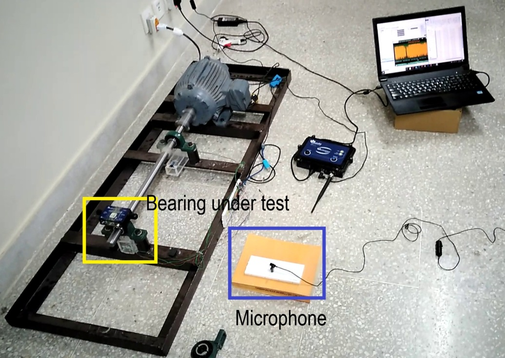 |
| :--- | :--- |

---

### FSTF Mechanical Laboratory

| **Overview:** The FSTF Mechanical Laboratory dataset provides sound recordings of ball bearings under both normal and faulty conditions at different operating speeds. It is built on a rotor test rig and is intended to support research on acoustic-based bearing fault diagnosis. Sound is captured at positions proximal and distal to the bearing housings.  **Experimental Setup:** Experiments were conducted on a specialized rotor system (PT 500 with the PT 500.12 roller bearing faults kit from Gunt) equipped with SKF 6004 deep-groove ball bearings. Fault conditions include artificially induced localized defects on the inner race, outer race, and rolling element (ball), a combined inner race, outer race, and ball defect, as well as a looseness defect resulting from prolonged operation (natural), giving six cases in total. Recordings were made at multiple operating speeds and at different sensor positions relative to the bearing housings.  **Data Characteristics:** The dataset is divided into two main categories: **Dataset 1**, consisting of recordings obtained using a stethoscope, and **Dataset 2**, consisting of recordings without a stethoscope under different operating conditions. In both cases, sound signals are acquired as `.wav` files using the **VibroTeak** mobile application (developed by the authors) at a sampling rate of **44.1 kHz**. The repository distributes them as 36 MATLAB `.mat` files (2 datasets × 6 cases × 3 speeds).  **Operating Conditions:** Tests cover normal and faulty bearings over a range of rotational speeds and measurement configurations (proximal/distal to the housing, with/without stethoscope). Recordings include real acoustic background noise.  **Source:** [Mendeley Data – Sound Datasets of a Rolling Element Bearing under Various Conditions](https://data.mendeley.com/datasets/n9y9c7xrz3/1) |  |
| :--- | :--- |

---

### GUET Multi-Condition Acoustic Ball Bearing

Acoustic dataset for bearing fault diagnosis under varying speed and load, recorded on an HZXT-008 rotor-bearing fault simulation test bench with a 6200 deep groove ball bearing. Five bearing states (normal, inner race pitting, outer race pitting, cage fracture, compound inner-outer race pitting) were each run at 3 speeds (800-1200 r/min) and 3 load levels (0-30% of rated torque). Two B&K 4966 microphones and one CRY333 microphone placed near the bearing housing recorded 50 minutes per condition at 32,768 Hz (2,250 minutes total). Data are in the proprietary B&K Connect .bkc format, split across five Mendeley records (one per bearing state).

* **Bearing:** 6200 deep groove ball bearing (Dm 23.45 mm, Bd 5.95 mm, 8 balls)
* **Sampling Rate:** 32.768 kHz
* **Operating Conditions:** 3 speeds (800, 1000, 1200 r/min) x 3 loads (0%, 15%, 30% of 6 N·m rated torque); 50 min continuous per condition
* **License:** CC BY 4.0 (Mendeley records); Data in Brief article is CC BY-NC 4.0
* **Caveats:** Files are in Brüel & Kjær .bkc format. The five Mendeley records share the same description; the fault class is given in each record title.
* **Source:** [Normal](https://doi.org/10.17632/j99rf8rsrz.1) \| [IR](https://doi.org/10.17632/w9d6g35kcy.1) \| [OR](https://doi.org/10.17632/g2kzkwnkgw.1) \| [Cage](https://doi.org/10.17632/jvv7p4wfgv.1) \| [IR+OR](https://doi.org/10.17632/bbvhrygxjz.1) \| [Publication](https://doi.org/10.1016/j.dib.2026.112919)

---

### AHU Parabolic Acoustic Mirror

Acoustic bearing fault dataset recorded with a parabolic acoustic mirror mounted in place of the bearing end cap, which focuses bearing sound onto a microphone, alongside a conventional directly placed microphone. The rig has a three-phase asynchronous motor with a Siemens frequency converter and hydraulic radial loading. It covers a healthy class and nine faulty bearings (three fault locations x three fault types) at three rotational speeds. Recordings are 25 s .mat files sampled at 20 kHz, organized into parabolic-mirror (PM) and direct-microphone (DM) folders.

* **Sampling Rate:** 20 kHz
* **Operating Conditions:** 3 rotational speeds (values not stated); radial load applied hydraulically (magnitude not stated)
* **License:** CC BY 4.0 (DataCite metadata); IEEE DataPort Standard Dataset, subscription required to download
* **Caveats:** IEEE DataPort subscription required to download.
* **Source:** [IEEE DataPort](https://doi.org/10.21227/jm8w-zw54)

---

### HB-Bearing (Real Background Noise)

Audio dataset for motor bearing fault diagnosis and sound source separation with background noise resembling a port coal-transport site. A Jinbiao YL601-4 motor at a fixed 1200 rpm drives a conveyor belt while several other motors run nearby, and background noise includes human voices and machinery. A consumer camera/recorder (Fluorite CS-C6Wi-3E4WFR) was placed 0.5 m above and 0.5 or 3 m horizontally from the faulty motor. The dataset has 13,500 clips of 4 s at 16 kHz covering normal, inner race, outer race, ball, and cage conditions.

* **Sampling Rate:** 16 kHz
* **Operating Conditions:** Fixed 1200 rpm; Jinbiao YL601-4 motor driving a port coal conveyor belt as load; recorder 0.5 m vertical and 0.5 or 3 m horizontal from the faulty motor; several motors running at once with background human voices and machinery
* **License:** CC BY 4.0 (DataCite metadata); IEEE DataPort Standard Dataset, subscription required to download
* **Caveats:** IEEE DataPort subscription required to download.
* **Source:** [IEEE DataPort](https://doi.org/10.21227/f6y0-ef20) \| [Publication](https://doi.org/10.1109/TASLPRO.2026.3685908)

---

### EJUST-PdM-1 (Video)

Video dataset for non-contact condition monitoring of rotating machinery. 4K, 60 fps recordings were taken of two GUNT teaching rigs (PT500 machinery diagnosis system and TM170 balancing apparatus) at 250-1000 RPM from several camera distances, heights and angles. Classes are normal operation, an outer-ring bearing fault, and imbalance at two severities (10 g and 37 g). The dataset is intended for motion magnification, optical-flow and video-based classification methods. Only the outer-ring fault class involves bearings.

* **Sampling Rate:** 60 fps video (4K)
* **Operating Conditions:** 250-1000 RPM; varied camera distance, height and viewing angle; two rigs (Gunt PT500, Gunt TM170)
* **License:** CC BY 4.0 (DataCite metadata); IEEE DataPort Standard Dataset, subscription required to download
* **Caveats:** One of the four classes is a bearing fault. IEEE DataPort subscription required to download.
* **Source:** [IEEE DataPort](https://doi.org/10.21227/ps5a-xr36) \| [Publication](https://doi.org/10.5220/0013715900003982)

---

### DCASE Challenge Task 2 — Bearing

The 'bearing' machine type in the DCASE Challenge Task 2 anomalous sound detection benchmarks (2022-2026, Hitachi and NTT). The machine is a laboratory setup rather than a toy model: two ball bearings support a shaft driven by a spindle motor, recorded in an anechoic chamber, with real factory noise mixed in afterwards. Anomalies were produced by deliberately damaging the machine (in 2022, bearing eccentricity in two directions). Training data contain only normal clips; test sets have normal and anomalous 10 s clips at 16 kHz under domain shifts (rotation speed, microphone position, bearing model). In the 2026 edition the bearing data are marked '(Emu)', meaning emulated two-channel recordings made by convolving measured impulse responses with previously recorded machine sound and noise.

* **Bearing:** Two ball bearings supporting a shaft driven by a spindle motor (bearing models not stated; 2024 varies bearing product model)
* **Sampling Rate:** 16 kHz (stated for 2022/MIMII DG; later records do not state it)
* **Operating Conditions:** Varies by edition: rotation speed and microphone position (2022-2024), bearing product model (2024), velocity only (2025); factory noise mixed in; source/target domain shift
* **License:** CC BY-NC-SA 4.0 (stated in all record descriptions); note: DataCite rights for 2022 and 2023 records list CC BY 4.0
* **Caveats:** The 2022 anomalies are eccentricity, not race defects. The 2026 bearing data are emulated. Record descriptions state CC BY-NC-SA 4.0.
* **Source:** [2022](https://doi.org/10.5281/zenodo.6355121) \| [2023](https://doi.org/10.5281/zenodo.7687463) \| [2024](https://doi.org/10.5281/zenodo.10850879) \| [2025](https://doi.org/10.5281/zenodo.15097778) \| [2026](https://doi.org/10.5281/zenodo.19336328) \| [Publication](https://arxiv.org/abs/2205.13879)

---

### Selçuk University Radar Bearing

Contactless bearing fault dataset from Selçuk University: a 24.125 GHz continuous-wave I/Q radar was pointed at a 1.1 kW induction motor whose 6205ZZ bearing was swapped among 16 conditions. The conditions are healthy, three lubricant-quantity faults, three excessive-load wear faults, and nine acid-corrosion faults on balls, outer ring and cage. Each class was recorded at 11 speeds (500-1500 rpm) and 5 brake loads (0-2.5 Nm), giving 880 recordings of 30 s with raw I/Q at 10 kHz, plus pre-computed time-domain features.

* **Bearing:** 6205ZZ deep groove ball bearing
* **Sampling Rate:** 10 kHz
* **Operating Conditions:** 1.1 kW three-phase asynchronous motor with magnetic powder brake; 11 speeds 500-1500 rpm x 5 loads 0-2.5 Nm
* **License:** Unknown (Kaggle license field 'Unknown')
* **Caveats:** Kaggle licence "Unknown".
* **Source:** [Kaggle](https://www.kaggle.com/datasets/yunusemreacar1/su-rf-sensing-lab-bearing-fault-diagnosis-dataset) \| [Publication](https://doi.org/10.34248/bsengineering.1673237)
---

## Motor-Level and Drive-Signal Datasets

### Mehran UET Motor Bearing (Vibration & Current)

Triaxial vibration and three-phase stator current of a three-phase induction motor belt-coupled to an alternator, from the NCRA Condition Monitoring Systems Lab at Mehran UET. Conditions are healthy and inner/outer race faults of six sizes (0.7-1.7 mm) on the drive-end bearing (6204-2Z/C3), each at 100, 200 and 300 W electrical load. The current record also includes a broken rotor bar at 100 and 300 W. The vibration record has 38 CSV files and the current record 39. A MEMS accelerometer (ADXL355) on the motor housing was read through an NI myRIO, and currents were measured with non-invasive sensors; both records state 10 kHz in blocks of 1000 samples per channel.

* **Bearing:** 6204-2Z/C3 deep groove ball bearing (drive end)
* **Sampling Rate:** 10 kHz (stated; acquired in 1000-sample blocks per channel)
* **Operating Conditions:** Three-phase induction motor belt-coupled to an alternator with variable electrical load; 100 W, 200 W, 300 W (broken rotor bar at 100 W and 300 W only); healthy vibration recorded with and without pulley
* **License:** CC BY 4.0
* **Caveats:** Vibration and current were recorded in the same runs (published as two Mendeley records). Files hold 1000-sample blocks with gaps rather than continuous streams.
* **Source:** [Mendeley (vibration)](https://doi.org/10.17632/fm6xzxnf36.2) \| [Mendeley (current)](https://doi.org/10.17632/gxdd74czwh.1) \| [Publication](https://doi.org/10.1016/j.dib.2022.108315)
---

### MCC5-THU Motor

Multi-mode fault dataset from a 2.2 kW three-phase asynchronous motor (QABP-90L2) driving a two-stage gearbox and magnetic powder brake, by MCC5 Group Shanghai, Tsinghua University and Zhengzhou University. 24 conditions cover healthy, electrical faults (inter-turn short, voltage unbalance, broken bars), mechanical faults (unbalance, bent shaft, eccentricity), laser-etched SKF 6205 bearing inner, outer and ball defects, and bearing-plus-electrical/mechanical compound faults. Triaxial drive-end vibration, three-phase current, torque and key-phase signals are sampled at 12.8 kHz over 282 runs of 90 s. Runs follow constant-speed/variable-torque (1000-3000 rpm) and constant-torque/variable-speed (20/40 Nm) profiles.

* **Bearing:** SKF 6205-2Z-C3 deep groove ball bearing
* **Sampling Rate:** 12.8 kHz
* **Operating Conditions:** 12 speed/load profiles: constant speed 1000/2000/3000 rpm with time-varying torque, and constant torque 20/40 Nm with time-varying speed; steady and transitional segments; 282 runs of 90 s
* **License:** CC BY 4.0
* **Caveats:** A related Mendeley record (ZZU-MCC5, r3yycxfyjf) with the same authors and sensors was published a week earlier.
* **Source:** [Mendeley](https://doi.org/10.17632/6s3dggj9mw.2) \| [IEEE DataPort](https://doi.org/10.21227/gm72-j779) \| [Publication](https://doi.org/10.1016/j.dib.2026.112583)

---

### IM-VACD (Smartphone)

Smartphone-recorded induction-motor fault dataset from the University of Ottawa, using the same eight SpectraQuest-faulted Marathon D396 motors as UOEMD. Classes are healthy, rotor unbalance, misalignment, stator winding fault, voltage unbalance, bowed rotor, broken rotor bars and faulty bearings. Triaxial accelerometer (100-490 Hz depending on device) and microphone audio were recorded with an iPhone 13, Samsung Galaxy S6 and Galaxy A50. Runs cover constant speeds of 15-30 Hz, unloaded and loaded, 10 s each.

* **Sampling Rate:** Accelerometer ~100 Hz (iPhone 13), 200 Hz (Galaxy S6), 490 Hz (Galaxy A50); acoustic 42 kHz per record (sample file shows 48 kHz set / ~47.6 kHz actual)
* **Operating Conditions:** Constant 15/20/25/30 Hz; unloaded and loaded; 10 s per file; three smartphones
* **License:** CC BY 4.0
* **Caveats:** Each fault class is a different physical motor. The record states 42 kHz acoustic, but the file checked was 48 kHz.
* **Source:** [Mendeley](https://doi.org/10.17632/yc8yhg5xjd.2) \| [Publication](https://doi.org/10.1016/j.ymssp.2026.114922)

---

### ESTOGU

Multimodal induction-motor fault dataset recorded at the Electrical Machines Laboratory of Eskişehir Technical University on a 2-pole Gamak AGM 90 L 2 motor driving a generator with a resistive load bank. Classes are normal, bearing ball defect, bearing ring defect, 3 and 5 broken rotor bars, and stator inter-turn short circuit. Triaxial vibration, three phase currents and one line voltage are sampled at 35 kHz for 20 s. Runs cover inverter-fed operation at 11 frequencies (45-50 Hz) and grid-fed operation at 50 Hz, each with six load levels (432 files).

* **Sampling Rate:** 35 kHz
* **Operating Conditions:** Inverter-fed: 11 supply frequencies 45-50 Hz (0.5 Hz steps, ~2700-3000 rpm) x 6 resistive loads (no load to 23 ohm); grid-fed: 50 Hz x 6 loads; 20 s per record
* **License:** CC BY 4.0
* **Caveats:** The README says the bearing faults were drilled; the setup PDF says field-worn bearings were used. Bearing type not stated. Per index.csv, classes were recorded on different days (normal and bearing ring defect share one day), so recording date is largely confounded with the label.
* **Source:** [Zenodo](https://doi.org/10.5281/zenodo.18222151)

---

### KIMM PMSM Multi-Location

Vibration dataset of frameless PMSM drive modules (CubeMars RI60 KV120) from KIMM, built to test fault diagnosis when the sensor is moved. Five modules represent normal, bearing fault (balls removed), magnet fault, stator assembly offset and 0.5 mm eccentricity. A triaxial MEMS accelerometer logged at 5 kHz at four housing locations, with and without five hammer or external-vibration disturbance patterns, at 500, 750 and 1000 rpm without load. There are 450 recordings of 10 s.

* **Sampling Rate:** 5 kHz (effective logging; sensor ODR 6.66 kHz)
* **Operating Conditions:** 500, 750, 1000 rpm, no load; 4 sensor locations; clean and 5 physically induced disturbance patterns (hammer impacts, external vibration); 10 s recordings
* **License:** CC BY 4.0
* **Caveats:** Each class was recorded on a separate drive module.
* **Source:** [Zenodo](https://doi.org/10.5281/zenodo.19550318) \| [Publication](https://doi.org/10.1038/s41598-026-73197-0)

---

## Prognostics (Run-to-Failure)

### University of Ferrara

| **Overview:** A run-to-failure dataset specifically focused on the prognostics of self-aligning double-row ball bearings.  **Experimental Setup:** The dataset was created from six accelerated run-to-failure tests, each on a new bearing under a constant radial load.  **Data Characteristics:** Radial acceleration sampled at 25.6 kHz as 5 s snapshots every 5 minutes over the entire duration of each test.  **Operating Conditions:** Experiments were conducted at a constant 40 Hz shaft speed; the radial load was constant within each test (3–5 kN across tests).  **Source:** [University of Ferrara Research Data](https://sfera.unife.it/handle/11392/2569668) \| Mendeley mirrors: [Part 1](https://data.mendeley.com/datasets/htk59pp5wx) \| [Part 2](https://data.mendeley.com/datasets/zz8hpyx939) \| [Publication (Data in Brief, 2024)](https://doi.org/10.1016/j.dib.2024.110620) | 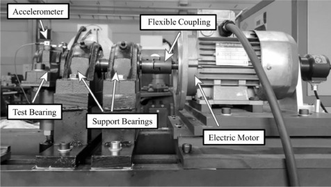 |
| :--- | :--- |

---

### DLR Oscillating Needle Bearing Endurance

Run-to-failure data from 8 endurance tests of oscillating needle bearings, two bearings per test, on a DLR test rig. Tests vary lubrication (three oils or no oil), oscillation amplitude (10-20 deg), radial load (9-19.4 kN) and frequency (5-10 Hz). Each bearing has acceleration and radial-displacement sensors sampled at 10 kHz, plus torque, radial force, oscillation angle and temperature channels. Data is recorded as periodic 10 s snapshots (about every 15 min in Test 7) and stored as MATLAB .mat files (36.7 GB zipped).

* **Bearing:** Needle roller bearings under oscillating motion (model not stated)
* **Sampling Rate:** 10 kHz (acceleration, distance, torque); 1 kHz position; 100 Hz force; 10 Hz temperature (measured in Test 7 files)
* **Operating Conditions:** 8 run-to-failure tests, 2 bearings per test; lubrication Oil1/Oil2/Oil3/NoOil; oscillation amplitude 10-20 deg; radial load 9-19.4 kN; frequency 5-10 Hz
* **License:** CC BY 4.0
* **Caveats:** No paper; bearing model not stated. Sampling rates were measured from the files.
* **Source:** [Zenodo](https://doi.org/10.5281/zenodo.20742912)

---

### Wind Turbine High-Speed Shaft Bearing

Field vibration data from the high-speed shaft bearing of a 2 MW wind turbine, where an inner race fault developed over about 50 days (7 Mar - 25 Apr 2013). There is one 6 s acquisition per day at 97,656 Hz (585,936 samples), each with a tachometer pulse-time signal. The data was contributed by Eric Bechhoefer (Green Power Monitoring Systems) and redistributed by MathWorks for its Predictive Maintenance Toolbox example. It is used in prognostic health-indicator and RUL studies.

* **Bearing:** High-speed shaft bearing of a 2 MW wind turbine gearbox (20-tooth pinion); model not stated
* **Sampling Rate:** 97,656 Hz
* **Operating Conditions:** Field operation of a 2 MW wind turbine; variable speed; one 6 s snapshot per day
* **License:** CC BY-NC-SA 4.0
* **Source:** [GitHub (MathWorks)](https://github.com/mathworks/WindTurbineHighSpeedBearingPrognosis-Data) \| [Publication](https://doi.org/10.36001/phmconf.2013.v5i1.2220)

---

## Field and SCADA Data

### SCA Bearing Dataset
* **Overview:** Vibration measurements of naturally occurring faults from an operational pulp mill.
* **Experimental Setup:** Data was collected from various machines between 2019 and 2022. The 11 cases include documented bearing failures and one confirmed non-bearing fault (shaft misalignment).
* **Data Characteristics:** Raw vibration data in `.mat` format, with "train" files (healthy data) and "test" files (data leading to failure). Includes signals, timestamps, speed, and fault labels.
* **Operating Conditions:** As the data is from a live industrial setting, operating conditions such as speed and load vary.
* **Source:** [Mendeley Data](https://data.mendeley.com/datasets/tdn96mkkpt/2) | [Publication (Data, 2023)](https://doi.org/10.3390/data8070115)

---

### Fraunhofer LBF Wind Turbine

Condition monitoring data from a 750 W direct-drive wind turbine running outdoors in Darmstadt, so rotor speed and loading vary with the wind. Faults include mass imbalance, aerodynamic (pitch) imbalance and etched damage on the outer race, inner race or rolling element of the 6007-2Z rotor-shaft bearings. Triaxial accelerometers on the front and rear bearings sample at 74 kHz, with nacelle and tower accelerometers, a tachometer, temperatures and wind measurements. Records are 5-minute .mat files.

* **Bearing:** Deep groove ball bearing UBC 6007 2Z (rotor shaft, front and rear)
* **Sampling Rate:** 74 kHz (bearing accelerometers); 37 kHz nacelle; 2.95 kHz structure and tachometer; 1.48 kHz others
* **Operating Conditions:** 750 W direct-drive small wind turbine on a building roof in Darmstadt; open-air operation with variable wind and rotor speed
* **License:** CC BY 4.0
* **Source:** [Zenodo](https://doi.org/10.5281/zenodo.11820597) \| [Publication](https://doi.org/10.1038/s41597-024-03934-5)

---

### CARE to Compare

Benchmark for early fault detection in wind turbine SCADA data: 95 sub-datasets from 36 turbines in three wind farms, at 10-minute resolution, with 86 to 957 features depending on the farm. 45 sub-datasets contain a labelled anomaly window leading to a documented fault, and 50 represent normal behaviour, each with turbine-status labels. Six of the anomaly events are bearing-related: two generator bearing failures and one gearbox bearing damage (Farm A), and three rotor/main bearing damages (Farm B). The paper also defines the CARE score for evaluating anomaly detectors.

* **Bearing:** Farm A: generator bearing (2 events), gearbox bearings (1); Farm B: rotor/main bearing (3); Farm C: none
* **Sampling Rate:** 10-min (avg, plus min/max/std for some signals)
* **Operating Conditions:** 36 turbines in 3 wind farms (A: EDP onshore Portugal; B, C: anonymised offshore Germany); 95 sub-datasets, 89 turbine-years
* **License:** CC BY-SA 4.0
* **Caveats:** 6 of the 45 anomaly events are bearing-related.
* **Source:** [Zenodo](https://doi.org/10.5281/zenodo.10958774) \| [Publication](https://doi.org/10.3390/data9120138)

---

### Luleå Wind Turbine Drivetrain Vibration

Field vibration data from the condition monitoring system of six wind turbines of the same type, each with a three-stage gearbox, in one wind farm in northern Sweden, over 46 consecutive months. Each file holds 1.28 s axial-vibration segments sampled at 12.8 kHz from an accelerometer on the gearbox output-shaft bearing housing (about one every 12 h), with time in years and shaft speed. One turbine had an inner-race failure of the output-shaft four-point ball bearing (replaced about 1.2 years in) and later an inner-race failure of a planet-stage cylindrical roller bearing, which led to a gearbox replacement about 2 years in. The other five turbines serve as healthy references.

* **Bearing:** Gearbox output shaft (HSS) four-point contact ball bearing; first-stage planet cylindrical roller bearing (failed bearings)
* **Sampling Rate:** 12.8 kHz (1.28 s segments of 16384 samples, about every 12 h)
* **Operating Conditions:** 6 wind turbines of the same model (3-stage gearbox: 2 planetary + 1 helical) in one farm in northern Sweden; 46 consecutive months of variable-speed operation; axial accelerometer on the output-shaft bearing housing
* **License:** Not stated
* **Caveats:** No label column: the bearing failures are documented only in the paper, as times relative to the start of recording, and files are not mapped to turbines. No licence stated.
* **Source:** [SND](https://doi.org/10.5878/bcmv-wq08) \| [Publication](https://doi.org/10.2991/ijcis.d.201105.001)
---

## Other Modalities

### Wind Turbine Bearings with White Etching Cracks

Ultrasound scan images of bearings with white etching crack (WEC) subsurface damage from five constant-load laboratory tests by DTU Wind Energy (2017, IRPWIND joint experiment). Each test ran two bearings in parallel until vibration exceeded a threshold. Both sides of each bearing were scanned, and attenuation above -10 dB indicates subsurface damage. The release is 20 BMP images (5 tests × 2 bearings × 2 sides, about 39 MB).

* **Bearing:** Bearings in a laboratory test rig, two in parallel (type not stated)
* **Operating Conditions:** Five tests under constant loading; each stopped when vibration exceeded a threshold
* **License:** CC BY-NC 4.0
* **Caveats:** 20 images; no associated paper.
* **Source:** [Zenodo](https://doi.org/10.5281/zenodo.1162737)

---

[Back to the summary](../README.md#summary-of-datasets)
